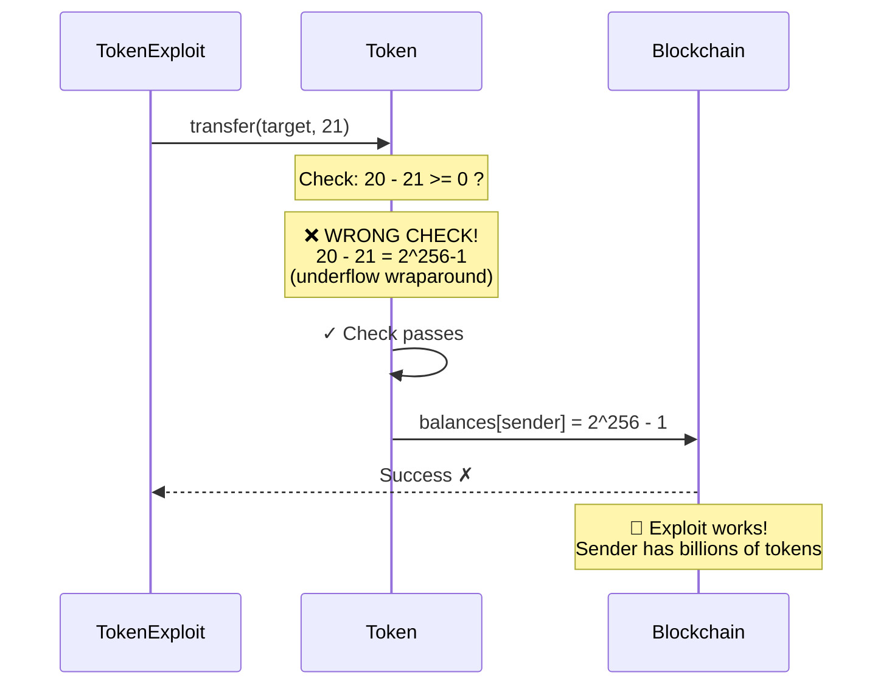
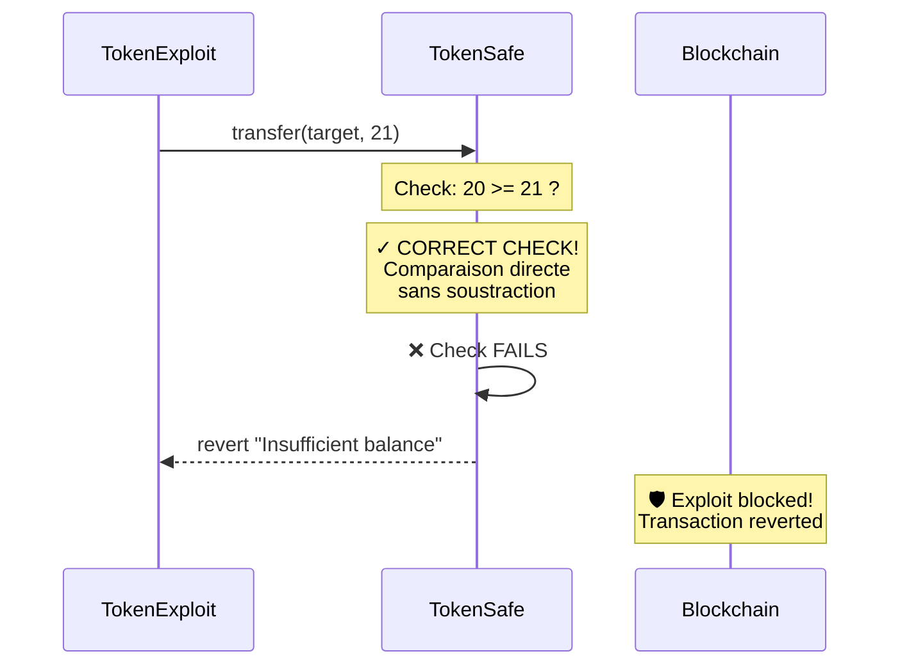

> **⚠️ EDUCATIONAL PURPOSE ONLY**
> This document is part of the [Ethernaut CTF](https://ethernaut.openzeppelin.com/) educational security challenges.
> The techniques described here are for **authorized security testing and learning purposes only**.
> **DO NOT** use these methods on contracts you don't own or without explicit authorization.

---

# Comparaison : Token vulnérable vs TokenSafe

## Token vulnérable (original)



**Le problème** :
```solidity
require(balances[msg.sender] - _value >= 0);
```
- Soustraction sur `uint256` wraparound avant le test
- `20 - 21` devient un énorme nombre positif
- Check passe alors qu'on n'a pas assez de tokens

---

## TokenSafe (sécurisé)



**La solution** :
```solidity
require(balances[msg.sender] >= _value, "Insufficient balance");
```
- Comparaison directe sans soustraction
- Pas de wraparound possible
- Évalue correctement : `20 >= 21` = false
- Transaction revert

---

## Différences clés

| Aspect | Token (vulnérable) | TokenSafe |
|--------|-------------------|-----------|
| **Check** | `a - b >= 0` | `a >= b` |
| **Opération** | Soustraction puis comparaison | Comparaison directe |
| **Underflow** | ✓ Possible | ✗ Impossible |
| **Résultat** | Exploit réussit | Exploit échoue |
| **Solidity** | 0.6.0 (no SafeMath) | 0.6.0 avec pattern sécurisé |

### Note
Depuis Solidity 0.8.0, le compilateur empêche automatiquement les underflows (checked arithmetic par défaut), ce qui aurait aussi bloqué cette vulnérabilité.
