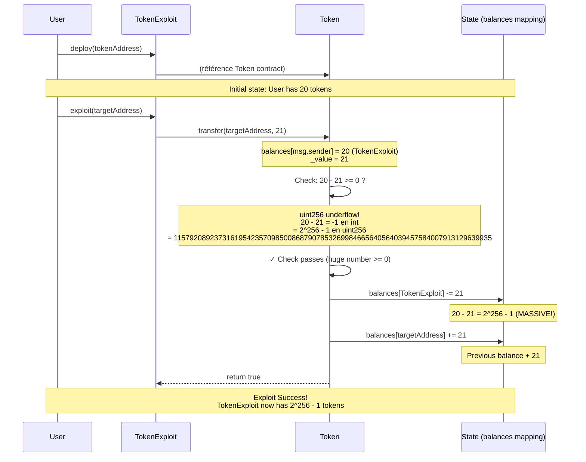

> **⚠️ EDUCATIONAL PURPOSE ONLY**
> This document is part of the [Ethernaut CTF](https://ethernaut.openzeppelin.com/) educational security challenges.
> The techniques described here are for **authorized security testing and learning purposes only**.
> **DO NOT** use these methods on contracts you don't own or without explicit authorization.

---

# Token Overflow Exploit - Sequence Diagram

## Explication de la faille

**Le problème** : `require(balances[msg.sender] - _value >= 0)`

En Solidity 0.6.0, `uint256` ne peut pas représenter les nombres négatifs. Quand tu soustrais un nombre plus grand d'un plus petit :
- `20 - 21` wraparound → `2^256 - 1` (un énorme nombre positif)
- La condition `require()` passe car c'est un énorme nombre positif ≥ 0
- Les balances sont mises à jour avec ce nombre gigantesque

**Résultat** : Tu passes de 20 tokens à `115792089237316195423570985008687907853269984665640564039457584007913129639935` tokens ✨
