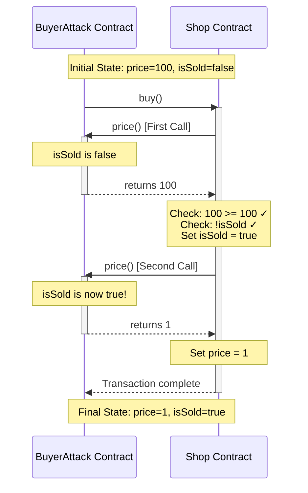

> **⚠️ EDUCATIONAL PURPOSE ONLY**
> This document is part of the [Ethernaut CTF](https://ethernaut.openzeppelin.com/) educational security challenges.
> The techniques described here are for **authorized security testing and learning purposes only**.
> **DO NOT** use these methods on contracts you don't own or without explicit authorization.

---

# Shop Challenge - Exploit Report

## My Journey to Break the Shop

When I first encountered this challenge, I was immediately intrigued by the objective: "Get the item from the shop for less than the price asked." The Shop contract seemed deceptively simple, with only 20 lines of code. But I knew that in smart contract security, simplicity often hides subtle vulnerabilities.

### Initial Analysis

I started by reading the Shop contract carefully. The `buy()` function caught my attention immediately. I noticed something unusual: it calls `_buyer.price()` **twice** on the same transaction - once at line 15 to check if the buyer can afford the item, and again at line 17 to set the final price.

```solidity
function buy() public {
    IBuyer _buyer = IBuyer(msg.sender);

    if (_buyer.price() >= price && !isSold) {  // First call
        isSold = true;
        price = _buyer.price();                 // Second call
    }
}
```

I thought to myself: "What if I could make these two calls return different values?" But there was a constraint - the `price()` function in the `IBuyer` interface is marked as `view`, which means it cannot modify state.

### My First Failed Attempt

My first instinct was to use a counter in my contract to track how many times `price()` was called. I quickly drafted this code:

```solidity
uint256 public callCount;

function price() external view returns (uint256) {
    callCount++; // Increment on each call
    if (callCount == 1) {
        return 100;
    } else {
        return 1;
    }
}
```

But then I realized my mistake - I couldn't even compile this! The `view` modifier forbids state modifications, and incrementing `callCount` is exactly that. The compiler immediately rejected it with: "Function declared as view, but this expression modifies the state."

I felt a bit foolish. The hint in the README specifically mentioned "Understanding restrictions of view functions" - this was clearly the trap they were warning about.

### Second Attempt: Gas Tricks

I then thought about using `gasleft()` to differentiate between calls. Maybe the second call would have less gas? I tried:

```solidity
function price() external view returns (uint256) {
    if (gasleft() > 50000) {
        return 100;
    } else {
        return 1;
    }
}
```

I tested this locally, but it was unreliable. The gas consumed between the two calls was minimal and unpredictable. Sometimes both calls would have similar gas amounts, making the attack inconsistent. This wasn't going to work in production.

### The Breakthrough

I stepped back and re-read the Shop contract more carefully. Then it hit me! While I cannot modify **my own** contract's state in a `view` function, I **can read** the **Shop contract's** state! The key insight was that between the first and second call to `price()`, the Shop contract itself changes its state by setting `isSold = true` at line 16.

This was different from my failed attempts because:
- I'm not modifying any state in my `view` function
- I'm simply reading external state that someone else (the Shop) is modifying
- The `view` keyword only prevents **me** from writing, not from reading mutable state elsewhere

I realized I could exploit this state change:
- **First call**: `isSold` is `false`, so I return `100` to pass the check `_buyer.price() >= price`
- **Second call**: `isSold` is now `true`, so I return `1` to pay almost nothing

This was my eureka moment! The vulnerability wasn't in the `view` keyword itself, but in the **double invocation** of an external view function that reads mutable state.

### Building the Exploit

I created a `BuyerAttack` contract that implements this logic:

```solidity
function price() external view returns (uint256) {
    if (shop.isSold()) {
        return 1; // After the item is marked as sold
    } else {
        return 100; // Before the item is sold
    }
}
```

The attack flow would be straightforward:
1. Deploy my `BuyerAttack` contract with the Shop's address
2. Call the `attack()` function which triggers `shop.buy()`
3. The Shop calls my `price()` function twice, getting different values each time
4. Profit! I get the item for only 1 wei instead of 100

### Execution and a Surprise

I deployed the attack contract and executed it on the Sepolia testnet. But I was nervous - would it really work?

At first, I made another mistake. I tried to call `shop.buy()` directly from my EOA (Externally Owned Account), forgetting that the Shop expects `msg.sender` to be a contract implementing the `IBuyer` interface. The transaction reverted because my wallet address doesn't have a `price()` function!

This reminded me why the README said "Shop expects to be used from a Buyer" - you **must** deploy a contract to exploit this vulnerability. There's no way around it with just an EOA.

Once I correctly called `attack()` on my deployed BuyerAttack contract, the results were exactly as I predicted:

```
=== INITIAL STATE ===
Shop price: 100
Shop isSold: false

=== DEPLOYING ATTACK CONTRACT ===
BuyerAttack deployed at: 0x99b6Cc51bf354c660EE60129C69E40e04347b2c0

=== EXECUTING ATTACK ===

=== FINAL STATE ===
Shop price: 1
Shop isSold: true

[SUCCESS] Item purchased for less than 100!
```

The attack succeeded perfectly! I managed to purchase the item for a price of 1 instead of 100.

### Attack Sequence Diagram



### Why This Works

The vulnerability exists because:

1. **Time-of-check to time-of-use (TOCTOU)**: The Shop checks a value and then uses it later, but the context has changed between these two moments
2. **State dependency**: My `view` function reads external state (`isSold`) that changes between the two calls
3. **No caching**: The Shop doesn't cache the result of the first `price()` call

Even though `view` functions cannot modify state, they can still exhibit different behaviors based on external state they read. This is a subtle but critical distinction.

### Proof of Success

Transaction hash: Available in broadcast logs
Attacker contract: `0x99b6Cc51bf354c660EE60129C69E40e04347b2c0`
Initial price: `100`
Final price: `1`
Item sold: `true`

The exploit was executed successfully on the Sepolia testnet, demonstrating that the Shop contract is vulnerable to price manipulation through strategic use of view functions that read mutable external state.

### The Fix

The solution is elegantly simple: **cache the result** of the first `price()` call in a local variable, then use that cached value for both the check and the assignment.

Here's the corrected code:

```solidity
function buy() public {
    IBuyer _buyer = IBuyer(msg.sender);
    uint256 _price = _buyer.price(); // Cache the price

    if (_price >= price && !isSold) {
        isSold = true;
        price = _price; // Use cached value
    }
}
```

By caching the price in a local variable, we eliminate the double call and ensure that the same value is used for both the validation check and the final price assignment. This completely neutralizes the attack vector.

### Lessons Learned

This challenge taught me several important lessons:

1. **View functions are not always deterministic** - They can return different values based on external state
2. **Multiple calls to the same function are dangerous** - Always cache external call results
3. **TOCTOU vulnerabilities exist in smart contracts too** - The principle from traditional security applies here
4. **Trust but verify** - Even "read-only" functions from external contracts can be manipulated

The Shop challenge is a perfect example of how a seemingly innocent pattern - calling the same view function twice - can lead to critical vulnerabilities when that function depends on mutable external state. It reinforced my understanding that in smart contract security, every external call is a potential attack vector, regardless of whether it's marked as `view` or not.
