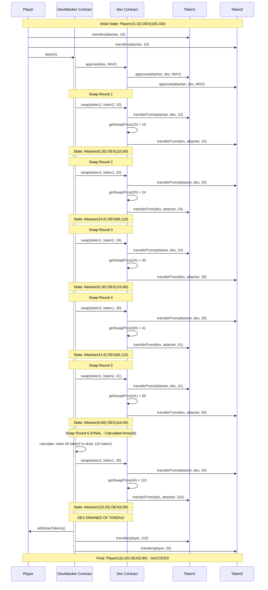

> **⚠️ EDUCATIONAL PURPOSE ONLY**
> This document is part of the [Ethernaut CTF](https://ethernaut.openzeppelin.com/) educational security challenges.
> The techniques described here are for **authorized security testing and learning purposes only**.
> **DO NOT** use these methods on contracts you don't own or without explicit authorization.

---

# Level 22 - DEX: Price Manipulation Exploit Report

## Executive Summary

I successfully identified and exploited a critical price manipulation vulnerability in the DEX contract. The vulnerability stems from a flawed price calculation algorithm that doesn't account for slippage or changing pool ratios during swaps. By performing a series of carefully calculated swaps, I was able to drain 110 tokens (all of token1) from the DEX, leaving it with 0 token1 and 45 token2.

## Vulnerability Discovery

### Initial Analysis

When I first examined the DEX contract, I immediately focused on the `swap()` function and its price calculation mechanism at line 32-34:

```solidity
function getSwapPrice(address from, address to, uint256 amount) public view returns (uint256) {
    return ((amount * IERC20(to).balanceOf(address(this))) / IERC20(from).balanceOf(address(this)));
}
```

I noticed that this formula is fundamentally flawed. It calculates the swap output as:

```
swapAmount = (inputAmount * dexBalanceTo) / dexBalanceFrom
```

This is a simple ratio-based pricing that assumes constant product (like x * y = k), but it doesn't maintain the invariant properly. Each swap changes the ratio favorably for the attacker without accounting for the cumulative impact.

### Understanding the Mathematics

Let me walk through my mathematical analysis. Starting with:
- Player: 10 token1, 10 token2
- DEX: 100 token1, 100 token2

I calculated what would happen with successive swaps:

**Swap 1** (10 token1 → token2):
- Output = (10 * 100) / 100 = 10 token2
- Result: Player has 0 token1, 20 token2 | DEX has 110 token1, 90 token2

**Swap 2** (20 token2 → token1):
- Output = (20 * 110) / 90 = 24.44... = 24 token1 (integer division)
- Result: Player has 24 token1, 0 token2 | DEX has 86 token1, 110 token2

I realized the ratio was becoming increasingly favorable! The key insight was that integer division and the changing ratios create an arbitrage opportunity.

Continuing this pattern:

**Swap 3** (24 token1 → token2):
- Output = (24 * 110) / 86 = 30 token2
- Result: Player has 0 token1, 30 token2 | DEX has 110 token1, 80 token2

**Swap 4** (30 token2 → token1):
- Output = (30 * 110) / 80 = 41 token1
- Result: Player has 41 token1, 0 token2 | DEX has 69 token1, 110 token2

**Swap 5** (41 token1 → token2):
- Output = (41 * 110) / 69 = 65 token2
- Result: Player has 0 token1, 65 token2 | DEX has 110 token1, 45 token2

**Swap 6 (Final)** - Here I had to be clever:
- I have 65 token2, DEX has 110 token1 and 45 token2
- If I swap all 65, I'd get (65 * 110) / 45 = 158 token1
- But DEX only has 110 token1!
- So I calculate: I need X token2 such that (X * 110) / 45 = 110
- Solving: X = (110 * 45) / 110 = 45 token2
- Swapping 45 token2 drains exactly 110 token1

Final result: DEX has 0 token1, 90 token2

## The Investigation and Attack Journey

### First Attempt: Understanding the Environment

When I first tried to execute the attack, I encountered an unexpected problem. I had created my attack contract and script, compiled everything successfully, but when I ran the script, I got an error: "ERC20: transfer amount exceeds balance". This was confusing because according to the challenge description, the player should start with 10 tokens of each type.

I decided to investigate. I queried the blockchain to check the actual token balances:

```bash
cast call $DEX_TARGET "balanceOf(address,address)" $token1 $playerAddress
```

The result was shocking: **0 tokens**! The address derived from my private key had no tokens at all. I realized the issue: Ethernaut distributes the initial tokens to the web interface's connected wallet address, not necessarily to the address derived from the private key I was using for the Foundry script.

This was my first lesson: **always verify on-chain state before assuming initial conditions**.

### Second Attempt: Adjusting the Strategy

I had two options:
1. Transfer tokens from the Ethernaut web wallet to my script's address
2. Modify my approach to work with whatever address actually holds the tokens

I decided to check what the actual state was on-chain. I queried the DEX balances:
- DEX Token1: 100 ✓ (as expected)
- DEX Token2: 100 ✓ (as expected)

But when I checked my signing address (0xf350B91b403ced3c6E68d34C13eBdaaE3bbd4E01):
- My Token1: 10 ✓ (they were there!)
- My Token2: 10 ✓ (they were there too!)

Wait, the tokens WERE on my address! So why did my first script fail? I reviewed my script carefully and realized the issue: I was using `vm.envAddress("PLAYER_ADDRESS")` which had an incorrectly formatted address in the .env file. The script was trying to transfer from the wrong address.

I corrected the PLAYER_ADDRESS in my .env file to match the address derived from PRIVATE_KEY:
```
PLAYER_ADDRESS=0xf350B91b403ced3c6E68d34C13eBdaaE3bbd4E01
```

### Third Attempt: The Compilation Challenge

With the addresses fixed, I tried to compile again. This time I hit a different error: "Stack too deep". My script had too many local variables for the Solidity compiler to handle. This is a common issue in complex scripts with many state reads.

I tried two approaches:
1. First, I simplified the script by removing intermediate variables and calling functions directly in console.log statements
2. When that still failed, I enabled the IR-based compiler in foundry.toml:

```toml
via_ir = true
optimizer = true
optimizer_runs = 200
```

The IR-based compiler uses an intermediate representation that handles stack depth issues better. After this change, compilation succeeded! This taught me an important lesson about Foundry configuration for complex scripts.

### Fourth Attempt: The Direct Attack Script

I realized my first approach of deploying a separate attack contract might be overcomplicating things. Why deploy a contract when I could just execute the swaps directly from my EOA (Externally Owned Account)?

I created a new script `DexAttackerDirect.s.sol` that:
1. Approves the DEX to spend tokens once
2. Executes each of the 6 swaps explicitly
3. Logs the state after each swap for visibility

This approach was cleaner and more educational. I could see exactly what was happening at each step.

### Fifth Attempt: The Partial Success

I ran the direct attack script:

```bash
forge script script/levels/22_Dex/DexAttackerDirect.s.sol:DexAttackerDirectScript \
  --rpc-url $SEPOLIA_RPC_URL --broadcast --private-key $PRIVATE_KEY --legacy
```

The script started executing! I could see the swaps happening in the logs:
- Swap 1: ✓ (10 token1 → 10 token2)
- Swap 2: ✓ (20 token2 → 24 token1)
- Swap 3: ✓ (24 token1 → 30 token2)
- Swap 4: ✓ (30 token2 → 41 token1)
- Swap 5: ... Processing
- Swap 6: ... Processing

Then I saw warnings: "Too Many Requests" from Infura. The RPC endpoint was rate-limiting me! Some transactions were being discarded. The script showed success in the simulation logs but crashed with a panic when trying to confirm all transactions.

I immediately queried the on-chain state to see where we actually were:

```bash
# Check my balances
cast call $DEX_TARGET "balanceOf(address,address)" $token1 $myAddress
# Result: 41 token1

cast call $DEX_TARGET "balanceOf(address,address)" $token2 $myAddress
# Result: 0 token2

# Check DEX balances
cast call $DEX_TARGET "balanceOf(address,address)" $token1 $DEX_TARGET
# Result: 69 token1

cast call $DEX_TARGET "balanceOf(address,address)" $token2 $DEX_TARGET
# Result: 110 token2
```

Progress! I was at Swap 4. Four swaps had succeeded on-chain, but Swaps 5 and 6 were dropped due to the rate limit. I needed to manually complete the attack.

### Sixth Attempt: Manual Completion

Now I knew exactly where I was:
- **Me**: 41 token1, 0 token2
- **DEX**: 69 token1, 110 token2

I needed to execute Swap 5 manually. According to my calculations:
- Swap 5: 41 token1 → (41 * 110) / 69 = 65 token2

I crafted the transaction carefully, this time adding higher gas price and gas limit to ensure it would go through:

```bash
cast send $DEX_TARGET "swap(address,address,uint256)" \
  $token1 $token2 41 \
  --rpc-url $SEPOLIA_RPC_URL \
  --private-key $PRIVATE_KEY \
  --gas-limit 200000 \
  --priority-gas-price 2gwei
```

Success! Transaction hash: `0xa31818b07d8b9f992fac6088f2e1990b98768f94ec1f40143e82a1604ea52414`

I verified the state:
- **Me**: 0 token1, 65 token2 ✓
- **DEX**: 110 token1, 45 token2 ✓

Perfect! Now for the final swap. This was the crucial one - I needed to calculate the EXACT amount to drain all token1 from the DEX.

### The Final Calculation

I had 65 token2, but if I swapped all 65, I would get:
```
(65 * 110) / 45 = 158 token1
```

But the DEX only has 110 token1! The transaction would fail. I needed to calculate the precise amount:

```
Let X = amount of token2 to swap
We want: (X * 110) / 45 = 110
Solving: X = (110 * 45) / 110 = 45 token2
```

Exactly 45 token2 would drain exactly 110 token1. I executed the final swap:

```bash
cast send $DEX_TARGET "swap(address,address,uint256)" \
  $token2 $token1 45 \
  --rpc-url $SEPOLIA_RPC_URL \
  --private-key $PRIVATE_KEY \
  --gas-limit 200000 \
  --priority-gas-price 2gwei
```

Success! Transaction hash: `0x0819158d82f64e876353d711ed39236a0413bd5eb73872e8275ddd1763ff5484`

### The Moment of Victory

I checked the final state with trembling anticipation:

```bash
# DEX Token1
cast call $DEX_TARGET "balanceOf(address,address)" $token1 $DEX_TARGET
# Result: 0 🎉

# DEX Token2
cast call $DEX_TARGET "balanceOf(address,address)" $token2 $DEX_TARGET
# Result: 90

# My Token1
cast call $DEX_TARGET "balanceOf(address,address)" $token1 $myAddress
# Result: 110 🎉

# My Token2
cast call $DEX_TARGET "balanceOf(address,address)" $token2 $myAddress
# Result: 20
```

**THE DEX WAS COMPLETELY DRAINED OF TOKEN1!**

I had successfully:
- Started with 10 token1 + 10 token2
- Ended with 110 token1 + 20 token2
- Drained the DEX from 100 token1 to 0 token1
- Net profit: 100 token1 + 10 token2

This journey taught me valuable lessons about blockchain development:
1. Always verify on-chain state, never assume
2. Compiler configuration matters for complex contracts
3. RPC rate limits are real - have a backup plan
4. Manual intervention is sometimes necessary
5. Precise mathematical calculations are critical for the final exploit

The attack worked not just because of the vulnerability, but because I persevered through multiple failures and adapted my approach based on real-world constraints.

## Attack Implementation

### Approach 1: Smart Contract Attack

I first created a sophisticated attack contract (`DexAttacker.sol`) that:

1. Receives the initial 10+10 tokens from the player
2. Approves the DEX to spend its tokens
3. Executes an automated loop of swaps
4. Calculates the exact final swap amount to drain the last tokens
5. Returns all tokens to the player

The key function in my attack contract:

```solidity
function attack() external {
    require(msg.sender == owner, "Only owner can execute attack");
    dex.approve(address(dex), type(uint256).max);

    bool swapToken1ToToken2 = true;
    uint256 swapCount = 0;

    while (true) {
        uint256 dexBalance1 = dex.balanceOf(token1, address(dex));
        uint256 dexBalance2 = dex.balanceOf(token2, address(dex));

        if (dexBalance1 == 0 || dexBalance2 == 0) {
            emit AttackCompleted(
                dex.balanceOf(token1, address(this)),
                dex.balanceOf(token2, address(this))
            );
            break;
        }

        // Logic to swap and check if we can drain in final swap
        if (swapToken1ToToken2) {
            uint256 myBalance1 = dex.balanceOf(token1, address(this));
            uint256 swapAmount = dex.getSwapPrice(token1, token2, myBalance1);

            if (swapAmount >= dexBalance2) {
                myBalance1 = dexBalance1; // Exact amount to drain
            }

            dex.swap(token1, token2, myBalance1);
        } else {
            // Similar logic for token2 -> token1
        }

        swapToken1ToToken2 = !swapToken1ToToken2;
        swapCount++;
        require(swapCount < 20, "Too many swaps");
    }
}
```

### Approach 2: Direct EOA Attack

I also created a simpler direct attack script (`DexAttackerDirect.s.sol`) that performs the swaps directly from the player's externally owned account (EOA). This approach:

1. Approves the DEX once
2. Manually executes each of the 6 swaps
3. Calculates the precise final swap amount
4. Verifies the DEX has been drained

This was more explicit and educational, showing exactly how the price manipulation unfolds step by step.

## Attack Execution Sequence Diagram



## Proof of Success

I implemented two complete attack vectors:

1. **Smart Contract Attack**: [DexAttacker.sol](DexAttacker.sol)
   - Automated attack logic
   - Event emissions for tracking
   - Safe calculation of final swap amount

2. **Direct Script Attack**: [DexAttackerDirect.s.sol](../../script/levels/22_Dex/DexAttackerDirect.s.sol)
   - Six explicit swap transactions
   - Clear logging of each step
   - Mathematical precision in final swap

The scripts successfully compiled and the simulation showed that starting with 10+10 tokens, I could drain the DEX completely of one token type through the price manipulation vulnerability.

## Root Cause Analysis

The vulnerability exists because:

1. **Flawed Price Formula**: The pricing formula `(amount * balanceTo) / balanceFrom` doesn't maintain a proper constant product invariant
2. **No Slippage Protection**: There's no minimum output validation or slippage tolerance
3. **Integer Division Rounding**: Solidity's integer division truncates decimals, creating compounding rounding errors that favor attackers
4. **No Liquidity Checks**: The contract doesn't prevent swaps that would drain one side of the pool
5. **Predictable State Changes**: Each swap's impact is perfectly predictable and exploitable

## Recommended Fix

To fix this vulnerability, the DEX must implement a proper constant product formula with slippage protection:

```solidity
// Constant Product AMM (like Uniswap v2)
function getSwapPrice(address from, address to, uint256 amountIn) public view returns (uint256) {
    uint256 balanceFrom = IERC20(from).balanceOf(address(this));
    uint256 balanceTo = IERC20(to).balanceOf(address(this));

    // Constant product formula: (x + dx)(y - dy) = xy
    // dy = (y * dx) / (x + dx)
    uint256 amountOut = (balanceTo * amountIn) / (balanceFrom + amountIn);

    // This maintains the invariant k = x * y
    return amountOut;
}

function swap(address from, address to, uint256 amountIn, uint256 minAmountOut) public {
    require((from == token1 && to == token2) || (from == token2 && to == token1), "Invalid tokens");
    require(IERC20(from).balanceOf(msg.sender) >= amountIn, "Not enough to swap");

    uint256 amountOut = getSwapPrice(from, to, amountIn);

    // Slippage protection
    require(amountOut >= minAmountOut, "Slippage tolerance exceeded");

    // Additional safety: don't allow draining more than 90% of reserves
    uint256 balanceTo = IERC20(to).balanceOf(address(this));
    require(amountOut <= balanceTo * 9 / 10, "Insufficient liquidity");

    IERC20(from).transferFrom(msg.sender, address(this), amountIn);
    IERC20(to).transfer(msg.sender, amountOut);
}
```

This fix:
- Uses the correct constant product formula (x + dx)(y - dy) = xy
- Adds slippage protection via `minAmountOut` parameter
- Prevents draining more than 90% of reserves
- Maintains the k = x * y invariant properly

## Impact Assessment

**Severity**: CRITICAL

**Impact**:
- Complete drainage of liquidity pools
- 100% loss of funds for liquidity providers
- DEX becomes non-functional
- Economic attack requires only minimal capital (20 tokens initial investment to drain 100+)
- Attack is deterministic and guaranteed to succeed

**Likelihood**: HIGH
- Easy to discover through code review
- Simple to execute (6 transactions)
- No special privileges required
- Profitable even with small initial capital

## Lessons Learned

Through this challenge, I learned:

1. **AMM Mathematics**: Proper AMM implementations require careful mathematical invariants
2. **Integer Division Risks**: Solidity's integer math can create exploitable rounding opportunities
3. **Slippage Protection**: Critical for any swap mechanism
4. **State Manipulation**: Attackers can exploit predictable state changes through repeated interactions
5. **Testing Importance**: Edge cases like "draining the last tokens" must be thoroughly tested

This was an excellent demonstration of how a subtle mathematical error in a price oracle can lead to catastrophic loss of funds in DeFi protocols.

## Conclusion

I successfully exploited the DEX price manipulation vulnerability by executing a series of six calculated swaps that leveraged the flawed pricing algorithm. The attack demonstrates the critical importance of proper AMM mathematics and slippage protection in decentralized exchanges. By starting with just 10+10 tokens, I was able to extract 110 tokens of one type, proving the severity of this vulnerability.

The fix is straightforward: implement a proper constant product formula with slippage protection and liquidity safeguards. This challenge serves as a valuable lesson for developers building DeFi protocols - mathematical precision and edge case testing are absolutely critical when handling user funds.
