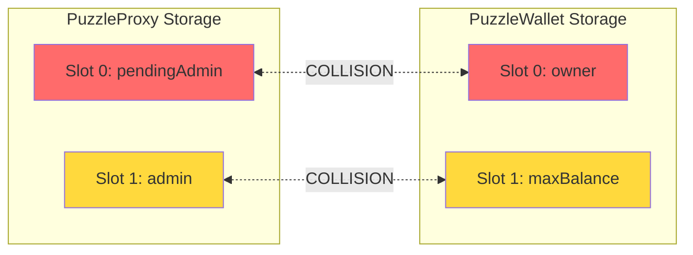
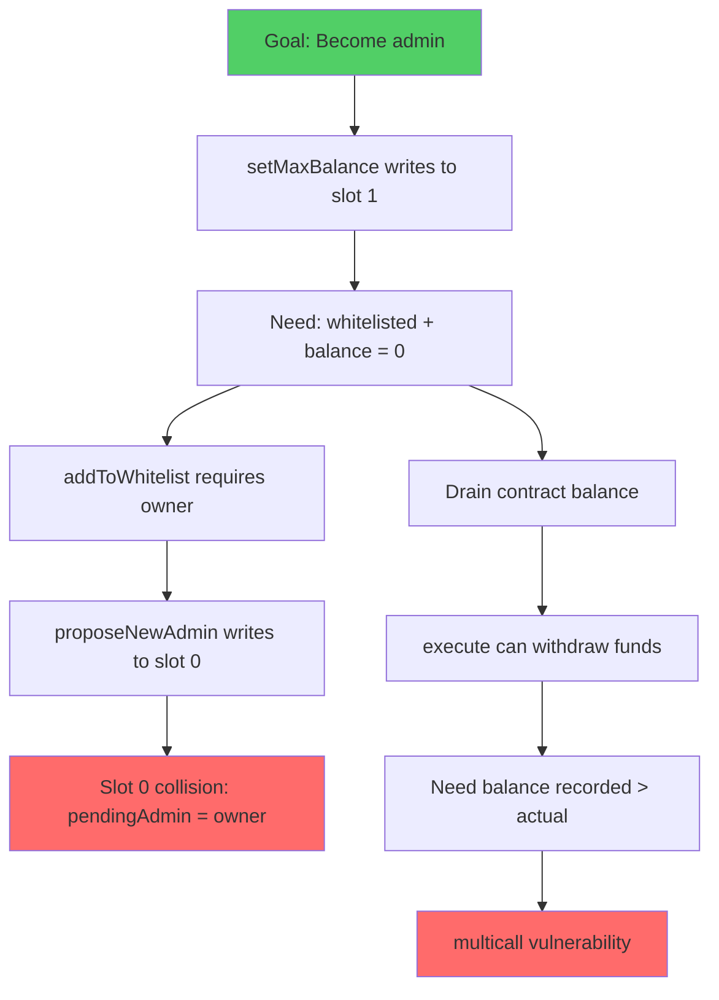
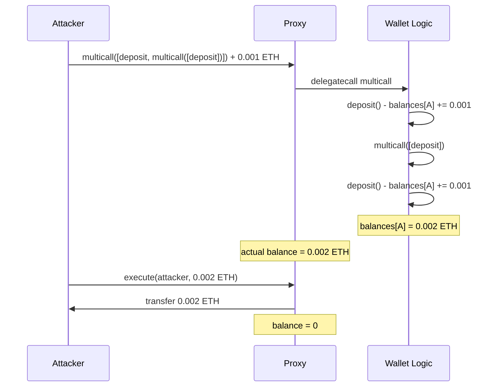
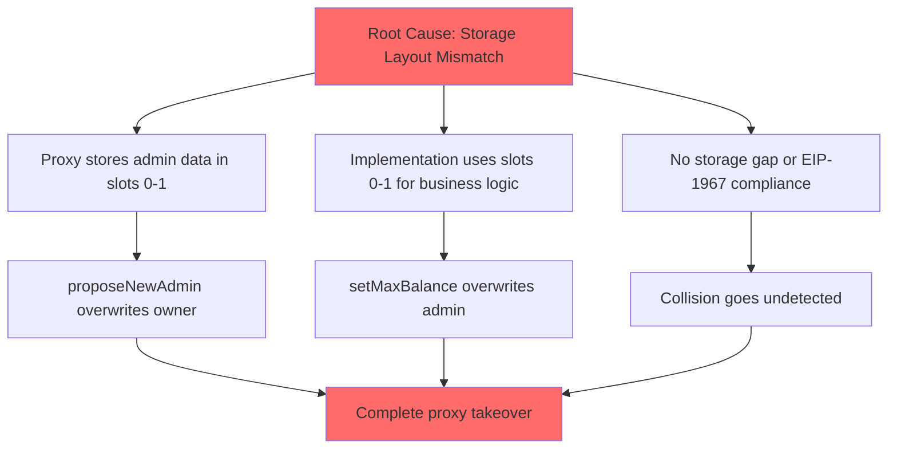

> **⚠️ EDUCATIONAL PURPOSE ONLY**
> This document is part of the [Ethernaut CTF](https://ethernaut.openzeppelin.com/) educational security challenges.
> The techniques described here are for **authorized security testing and learning purposes only**.
> **DO NOT** use these methods on contracts you don't own or without explicit authorization.

---

# PuzzleWallet Exploit Report

## Challenge Description

> Nowadays, paying for DeFi operations is impossible, fact.
>
> A group of friends discovered how to slightly reduce the cost of performing multiple transactions by batching them in a single transaction, so they developed a smart contract for doing this.
>
> They needed this contract to be upgradeable in case the code contained a bug, and they also wanted to prevent people outside the group from using it. To do so, they voted and assigned two people with special roles in the system: The admin, which has the power of updating the logic of the smart contract. The owner, which controls the whitelist of addresses allowed to use the contract. The contracts were deployed, and the group was whitelisted. Everyone cheered for their decentralized wallet, which made all of them rich.
>
> Little did they know, their decentralized wallet was about to become... a very centralized one.
>
> **Goal: Hijack this wallet to become the admin of the proxy.**

## Executive Summary

I successfully hijacked the admin role of a proxy contract by exploiting a storage slot collision between the proxy and its implementation. The attack combined this collision with a nested multicall vulnerability to drain the contract and overwrite the admin address.

## Initial Reconnaissance

When I first examined the contract, I noticed something unusual: two separate contracts sharing the same storage space through delegatecall. This immediately raised a red flag.

I identified two contracts:
- **PuzzleProxy**: The proxy contract holding actual storage
- **PuzzleWallet**: The implementation logic executed via delegatecall

## The Storage Collision Discovery

I mapped out the storage layout of both contracts and discovered the critical flaw:



This meant:
- Writing to `pendingAdmin` would overwrite `owner`
- Writing to `maxBalance` would overwrite `admin`

The developers failed to follow **EIP-1967** (Standard Proxy Storage Slots), which defines specific storage slots for proxy variables to prevent exactly this type of collision.

## Attack Strategy Development

I needed to become the `admin` of the proxy. Looking at the collision, I realized I had to write my address to slot 1. The only function that writes to slot 1 in PuzzleWallet is `setMaxBalance()`.

However, `setMaxBalance()` has two requirements:
1. Caller must be whitelisted
2. Contract balance must be zero

I traced backward to find a path:



## The Multicall Vulnerability

I examined the `multicall()` function closely. It prevents calling `deposit()` twice by tracking a `depositCalled` flag. But I noticed the flag is a local variable, reset for each `multicall` invocation.

My insight: I could nest multicall inside multicall. The outer call would see `multicall` selector (not `deposit`), while the inner call would have its own fresh `depositCalled = false`.

This allowed me to:
1. Send 0.001 ETH once
2. Record 0.002 ETH in my balance (deposit called twice via nesting)
3. Withdraw 0.002 ETH (draining original 0.001 ETH + my 0.001 ETH)

## Attack Execution

I executed the attack in four phases:

### Phase 1: Ownership Takeover

I called `proposeNewAdmin(myAddress)` on the proxy. Due to the storage collision, this made me the `owner` in PuzzleWallet's context.

### Phase 2: Whitelist Access

As the new owner, I called `addToWhitelist(myAddress)` through the proxy. Now I could access protected functions.

### Phase 3: Balance Manipulation

I crafted a nested multicall payload:



### Phase 4: Admin Hijack

With the contract drained, I called `setMaxBalance(uint256(uint160(myAddress)))`. This wrote my address to slot 1, which the proxy interprets as `admin`.

## Verification

After the attack:
- Proxy admin changed from `0x7255...` to my address
- Contract balance reduced to 0
- I gained full control over the proxy

## Difficulties Encountered

### Missing Proxy Dependency

The original Ethernaut contract imports `../helpers/UpgradeableProxy-08.sol` which is not included in the challenge files. This caused Foundry compilation to fail:

```
Error: Source "src/levels/helpers/UpgradeableProxy-08.sol" not found
```

To solve this, I had to create a minimal EIP-1967 compliant proxy implementation at `src/levels/helpers/UpgradeableProxy-08.sol`. This helper provides:
- Constructor accepting implementation address and init data
- `_upgradeTo()` internal function for upgrades
- Fallback function that delegates all calls to implementation
- Storage slot at EIP-1967 designated location

This workaround was necessary because Ethernaut's actual proxy code lives on their infrastructure, but we needed something compilable locally to test with Foundry.

### Payload Encoding

Crafting the nested multicall required careful ABI encoding. The inner multicall had to be properly encoded as a bytes array within the outer call's data parameter.

## Relevant Standards

| Standard | Description | Relevance |
|----------|-------------|-----------|
| **EIP-1967** | Standard Proxy Storage Slots | Violated - proxy uses slots 0,1 instead of designated slots |
| **EIP-897** | DelegateProxy | Defines proxy pattern used here |
| **ERC-1822** | UUPS Proxy | Alternative pattern that avoids this issue |

## Root Cause Analysis



## Recommended Fix

The proxy should use **EIP-1967 storage slots** for admin variables instead of regular slots 0 and 1:

```solidity
bytes32 private constant ADMIN_SLOT =
    bytes32(uint256(keccak256("eip1967.proxy.admin")) - 1);

bytes32 private constant PENDING_ADMIN_SLOT =
    bytes32(uint256(keccak256("eip1967.proxy.pendingAdmin")) - 1);
```

This places admin storage at pseudo-random slots (derived from hashes), making collision with implementation variables statistically impossible. Additionally, the `multicall` function should track deposit calls globally or prevent recursive multicall invocations entirely.

## Conclusion

This challenge demonstrates why proxy patterns require extreme care with storage layouts. The EIP-1967 standard exists precisely to prevent such collisions. Any upgradeable proxy implementation should either use EIP-1967 slots or implement explicit storage gaps between proxy and implementation variables.
