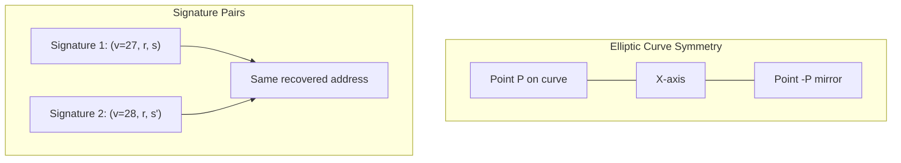
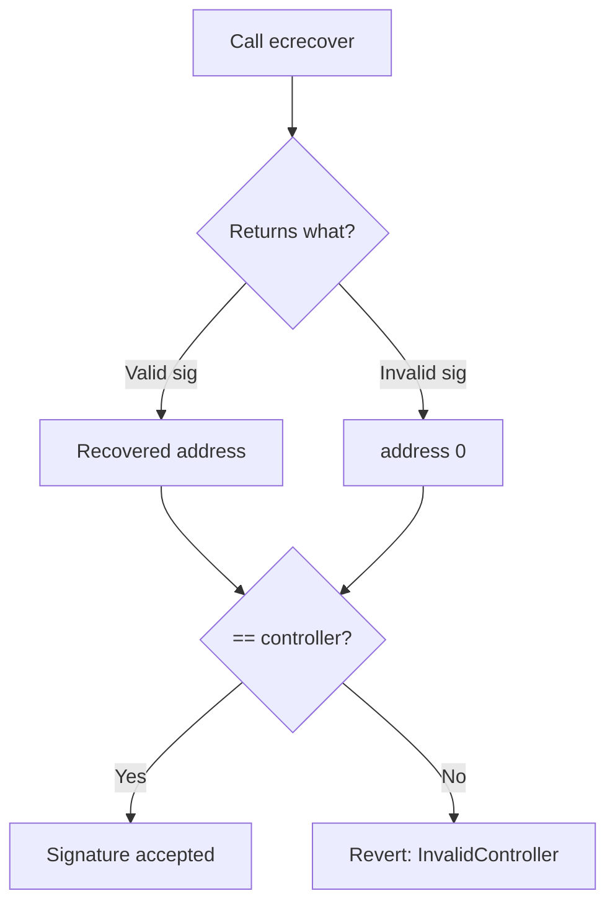
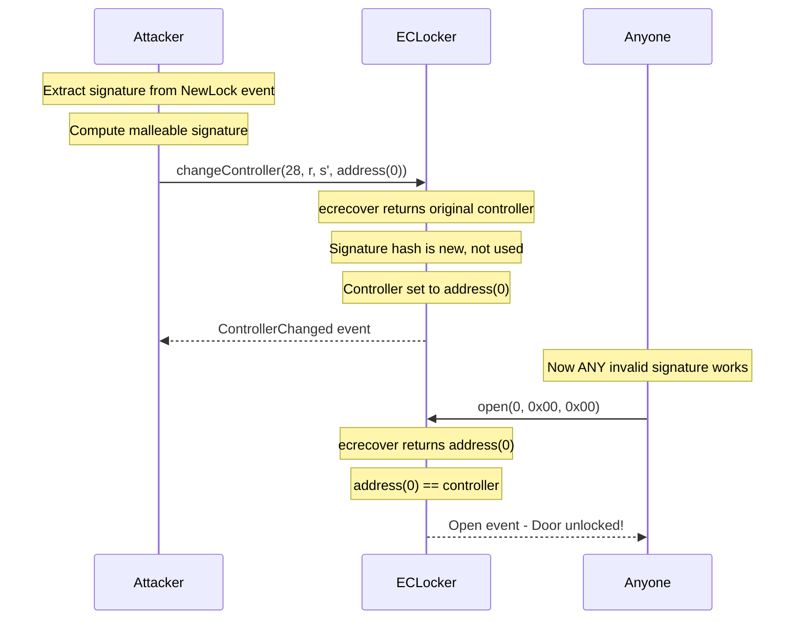

> **⚠️ EDUCATIONAL PURPOSE ONLY**
> This document is part of the [Ethernaut CTF](https://ethernaut.openzeppelin.com/) educational security challenges.
> The techniques described here are for **authorized security testing and learning purposes only**.
> **DO NOT** use these methods on contracts you don't own or without explicit authorization.

---

# Impersonator - Ethernaut CTF Exploit Report

## The Challenge

SlockDotIt's ECLocker system uses ECDSA signatures to control IoT gate locks. Only the authorized controller should be able to open the door. My mission: compromise the system so that **anyone** can open the door.

---

## Initial Analysis

When I first examined the contracts, I noticed something interesting: the Impersonator contract is just a factory. The real target is the ECLocker contract deployed by it. I had to retrieve the ECLocker address from the `NewLock` event logs, not from Ethernaut's console directly.

I identified the core security mechanism in `_isValidSignature()`:

1. Recover signer address via `ecrecover`
2. Verify it matches the stored controller
3. Check signature hash against `usedSignatures` mapping
4. Mark signature as used

The signature replay protection seemed solid at first glance. But then I noticed the original signature was publicly emitted in the `NewLock` event. Why would that matter if signatures can only be used once?

---

## Discovering the Vulnerability

I remembered something about ECDSA signatures on elliptic curves: they come in pairs. The secp256k1 curve is symmetric on the X-axis, which means for every valid signature `(v, r, s)`, there exists a "mirror" signature `(v', r, s')` that recovers to the exact same address.



The transformation is simple:
- `s' = n - s` where n is the curve order
- `v' = 55 - v` (flips between 27 and 28)

Both signatures are mathematically valid for the same message and signer. But they produce different hashes! This is the signature malleability vulnerability described in EIP-2.

---

## First Attempt: Wrong Approach

I extracted the original signature from the `NewLock` event:

| Component | Value |
|-----------|-------|
| r | `0x1932cb...3b91` |
| s | `0x78489c...bff2` |
| v | 27 |

I computed the malleable signature with `s' = n - s` and `v' = 28`.

My first instinct was to call `open()` directly with this malleable signature. The transaction succeeded and the `Open` event was emitted. I submitted to Ethernaut... **rejected**.

I thought maybe I needed to become the controller myself. So I called `changeController()` with the malleable signature, setting the new controller to my address. Then I signed the msgHash with my own private key and called `open()`. Both transactions confirmed. I submitted again... **still rejected**.

I was frustrated. The attack worked technically - I could open the lock - but Ethernaut wouldn't validate.

---

## The Missing Insight

I re-read the challenge prompt: *"Can you compromise the system in a way that **anyone** can open the door?"*

Anyone. Not just me. The challenge is literal.

Then it clicked. I looked at how `_isValidSignature()` handles invalid signatures:



If `ecrecover` receives garbage or an invalid signature, it returns `address(0)`. So if I set the controller to `address(0)`, then ANY invalid signature would pass the check because `address(0) == address(0)`.

This is the real attack: make the lock openable by literally anyone with any random signature.

---

## The Successful Attack

I needed a fresh instance since I had already used the malleable signature on previous ones. With the new instance (ECLocker at `0xa13735ba1adc4D4c6db381F3C04B58301D91768D`), I executed a single transaction using cast:

**The exact command that solved the challenge:**
```bash
cast send 0xa13735ba1adc4D4c6db381F3C04B58301D91768D \
  "changeController(uint8,bytes32,bytes32,address)" \
  28 \
  0x1932cb842d3e27f54f79f7be0289437381ba2410fdefbae36850bee9c41e3b91 \
  0x87b7639b5f24e93bf106794133370f950d5e9b00f5b5c8cbd866a487529b814f \
  0x0000000000000000000000000000000000000000 \
  --rpc-url https://sepolia.infura.io/v3/882fe0e538954e6e94d5cda92e2593f2 \
  --private-key $PRIVATE_KEY
```

Breaking down the parameters:
- `v' = 28` (flipped from original 27)
- `r = 0x1932cb842d3e27f54f79f7be0289437381ba2410fdefbae36850bee9c41e3b91` (unchanged)
- `s' = 0x87b7639b5f24e93bf106794133370f950d5e9b00f5b5c8cbd866a487529b814f` (n - s)
- `newController = 0x0000000000000000000000000000000000000000`

The transaction confirmed. The controller was now the null address. Anyone calling `open()` with any garbage signature would succeed because `ecrecover` returns `address(0)` for invalid inputs.

I submitted to Ethernaut. **Validated.**



---

## Difficulties Encountered

### 1. Misunderstanding the Goal

I wasted two instances trying to become the controller myself. The challenge says "anyone can open the door" - I interpreted this as "prove you can open it without authorization." But the actual requirement is to make the system universally compromised. Lesson learned: read the prompt literally.

### 2. Signature Format in Assembly

The constructor uses inline assembly to parse the signature. I initially struggled to understand the memory layout:

| Offset | Content |
|--------|---------|
| 0x00 | Length prefix |
| 0x20 | r (32 bytes) |
| 0x40 | s (32 bytes) |
| 0x60 | v (32 bytes, padded) |

The 96-byte format with padded `v` differs from the standard 65-byte compact format. I had to trace through the assembly to confirm the layout.

### 3. Hash Collision Confusion

I initially thought the constructor's `keccak256(_signature)` might differ from `_isValidSignature`'s `keccak256(abi.encode([r, s, v]))`. After analysis, both hash the same 96 bytes in the same order, so the original signature IS marked as used. Only the malleable signature bypasses this.

---

## Relevant Standards

### EIP-2: Homestead Hard Fork

EIP-2 addressed signature malleability for **transaction signatures** by requiring s-values in the lower half of the curve order. However, this protection does not apply to `ecrecover` calls within smart contracts - developers must implement it themselves.

### EIP-191: Signed Data Standard

The contract correctly uses the `"\x19Ethereum Signed Message:\n32"` prefix for message hashing. This prevents signature reuse across different contexts but does nothing against malleability within the same context.

### EIP-712: Typed Structured Data

A more robust signing standard that, combined with proper malleability checks, provides stronger security guarantees. Not used in this contract.

---

## The Fix

Add a single require statement to reject high-s signatures:

```solidity
require(uint256(s) <= 0x7FFFFFFFFFFFFFFFFFFFFFFFFFFFFFFF5D576E7357A4501DDFE92F46681B20A0);
```

This constant is `n/2`. Any signature with `s > n/2` can be transformed to its canonical low-s form, so rejecting high-s values eliminates the malleability issue entirely.

Better yet: use OpenZeppelin's ECDSA library which handles this automatically and has been battle-tested across thousands of deployments.

---

## Conclusion

The Impersonator challenge taught me that ECDSA has mathematical properties that are easy to overlook. The signature replay protection in ECLocker was well-intentioned but fundamentally flawed because it treated `(r, s, v)` as unique when mathematically it is not.

The real lesson goes beyond the technical exploit: always use established cryptographic libraries instead of rolling your own. OpenZeppelin exists for a reason.

My failed attempts before finding the correct solution also reinforced something important - in CTF challenges, the wording matters. "Anyone can open the door" means exactly that: not "you can open the door" but "the system is broken for everyone."
